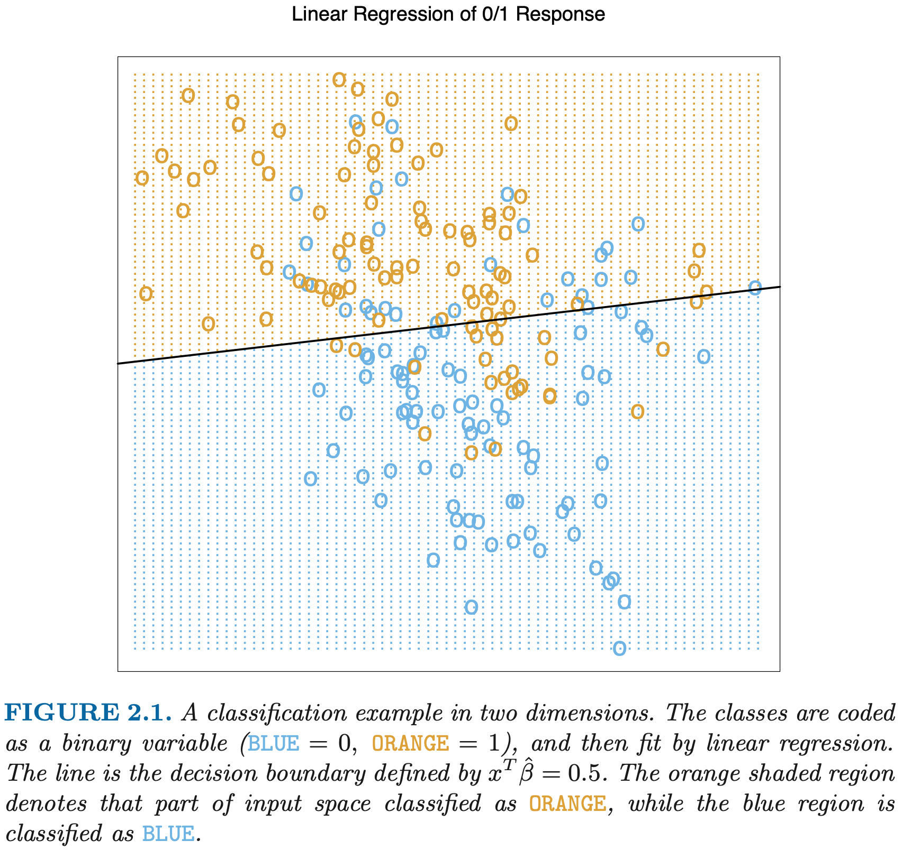
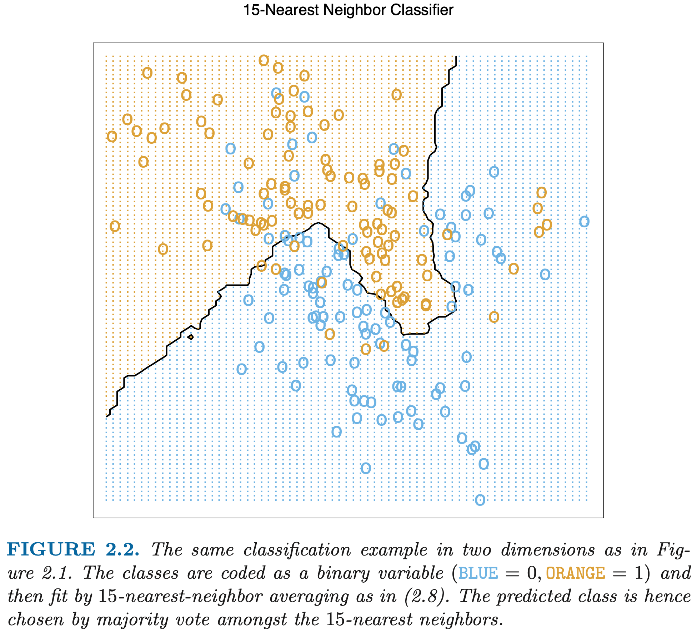
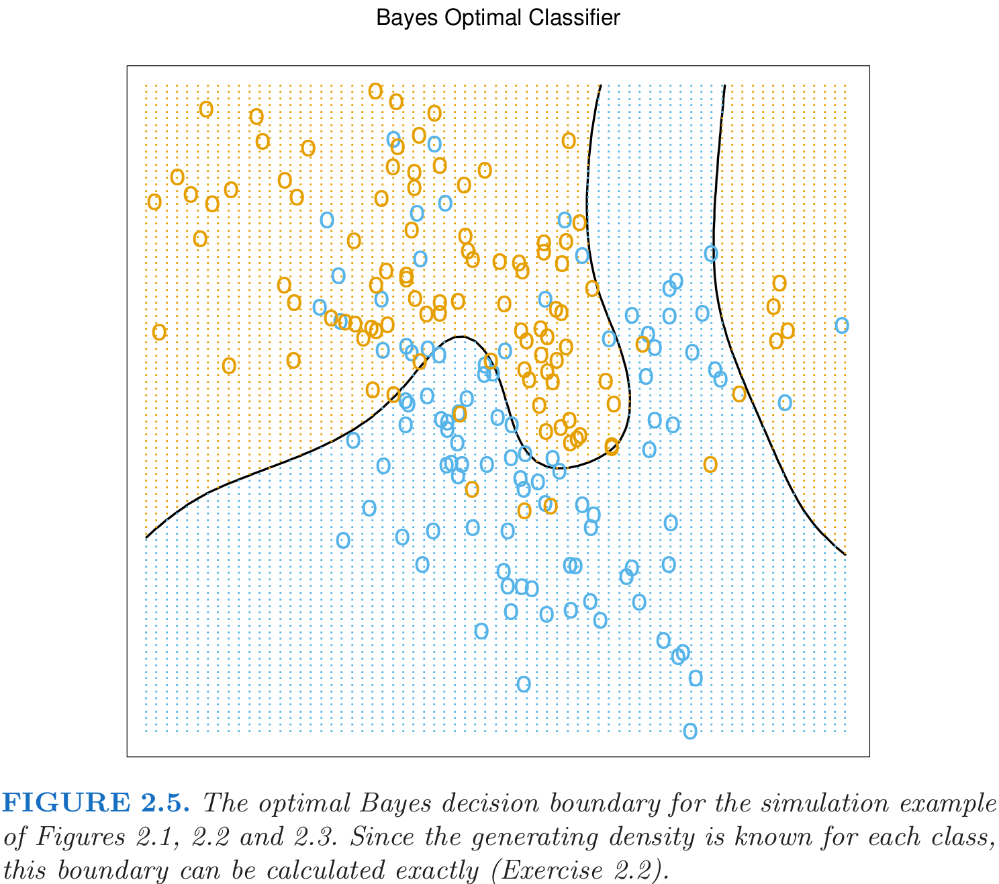
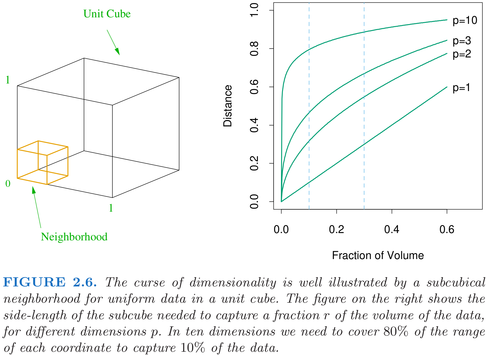
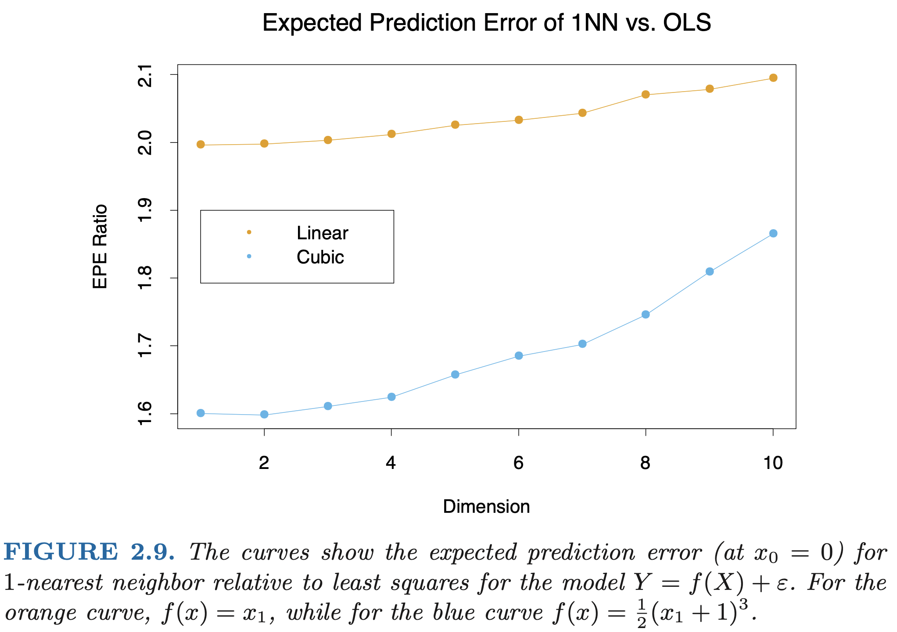

<!-- 
 -->

# **Overview of Supervised Learning**

The goal is to use the inputs (predictors, independent variables) to predict the values of the outputs (responses, dependent variables). This exercise is called supervised learning.

## **Variable Types and Terminology**

-  Inputs vary in measurement type: Some methods are defined most naturally for quantitative inputs, some most naturally for qualitative and some for both.

- Ordered categorical: there is an ordering between the values, but no metric notion 

- Dummy variables: $K$-level qualitative variable is represented by a vector of $K$ binary variables
or bits, only one of which is “on” at a time. (symmetric in the levels of the factor.)

- Terminology:
  - Input variable: $X$, components $X_j$.
  - Quantitative outputs: $Y$
  - Qualitative outputs: $G$
  - Observed values of $X$: lowercase, $x_i$ (a scalar or vector)
  - $N$ input $p$-vectors $x_i$: $\mathbf{X}\in \mathbb{R}^{N\times p}$
  - $\mathbf{x}_j$: all the observations on variable $X_j$ ($N$-vector).
  - All vectors are assumed to be column vectors, the $i$th row of $\mathbf{X}$ is $x_i^T$.

## **Least Squareds and Nearest Neighbors**

The linear model makes huge assumptions about structure and yields stable but possibly inaccurate predictions. The method of k-nearest neighbors makes very mild structural assumptions: its predictions are often accurate but can be unstable.

### **Linear Moders and Least Squares**

Given a vector of inputs $X^T=(1, X_1, X_2, ..., X_p)$, the output $Y$ is predicted via the model

$$\tag{2.1}
\hat{Y} = \hat{\beta_0} + \sum_{j=1}^p X_j\hat{\beta_j} = X^T\hat{\beta}.
$$

In general $\hat{Y}$ can be a $K$-vector, in which case $\beta$ would be a $p\times K$ matrix of coefficients. In the $(p+1)$-dimensional input-output space, $(X,\hat{Y})$ represents a hyperplane.

The most popular method for fiting the linear model to a set of training data is *least squares*, that is, the coefficients $\beta$ is picked to minimize the residual sum of squares
$$\tag{2.2}
\text{RSS}(\beta) = \sum_{i=1}^N(y_i-x_i^T\beta)^2=(\mathbf{y}-\mathbf{X}\beta)^T(\mathbf{y}-\mathbf{X}\beta),
$$
where $\mathbf{X}$ is an $N\times p$ matrix with each row an input vector, and $\mathbf{y}$ is an $N$-vector of the outputs in the training set. Differentiating w.r.t $\beta$ we get the *normal equations*

$$\tag{2.3}
\mathbf{X}^T(\mathbf{y}-\mathbf{X}\beta) = 0.
$$

If $\mathbf{X}^T\mathbf{X}$ is nonsingular, then the unique solution is given by 
$$\tag{2.4}
\hat{\beta}=(\mathbf{X}^T\mathbf{X})^{-1}\mathbf{X}^T\mathbf{y},
$$
and the fitted value at the $i$th input $x_i$ is $\hat{y}_i=x_i^T\hat{\beta}$.

Figure 2.1 shows a scatterplot of training data on a pair of inputs $X_1$ and $X_2$. The two predicted classeds are separated by the *decision boundary* $\{x:x^T\hat{\beta}=0.5\}$.

**Where did the constructed data come from?**

- bivariate Gaussian distributions with uncorrelated components and different means. (linear decision boundary is the best.)
- a mixture of 10 low-variance Gaussian distributions, with individual means themselves distributed as Gaussian. (nonlinear and disjoint is the best.)

### **Nearest-Neighbor Methods**

Using the observations in the training set $\mathcal{T}$ closest in input space to $x$ to form $\hat{Y}$. The $k$-nearest neighbor fit for $\hat{Y}$ is defined as follows:
$$\tag{2.5}
\hat{Y}(x)=\frac{1}{k} \sum_{x_i\in N_k(x)} y_i,
$$
where $N_k(x)$ is the neighborhood of $x$ defined by the $k$ closest points $x_i$ in the training sample. Closeness implies a metric, which for the momoent we assume is Euclidean distance.

In Figure 2.2, we see that far fewer training observations are misclassified than in Figure 2.1. A little thought suggests that the error on the training data should be approximately an increasing function of $k$, and will always be $0$ for $k=1$.

The effctive number of parameters for KNN is $N/k$ and is generally bigger than $p$, and decreases with increasing $k$. There would be $N/k$ neighborhoods and fit one parameter (a mean) in each nieghborhood.

If we use sum-of-squared errors on the training set as criterion for picking $k$, we would always pick $k=1$.

For the mixture Scenario 2, it seems that KNN would be more apropriate, while for Gaussian data the decision boundaries of k-nearest neighbors would be unnecessarily noisy.

### **From Least Squares to Nearest Neighbors**

- Linear model: decision boundary is very smooth, stable to fit, rely on the assumption that a liear decision boundary is appropriate. **Low variance and potentially high bias**. (scenario 1)
- KNN: do not rely on any stringent assumptions about the underlying data, can adapt to any situation, depends on a handful of input points and their particular positions, wiggly and unstable. **High variance and low bias**. (scenario 2)
- The variants of linear model and KNN: 
  
  - Kernel methods use weights that decrease smoothly to zero with dis- tance from the target point, rather than the effective 0/1 weights used by $k$-nearest neighbors.
  - In high-dimensional spaces the distance kernels are modified to em- phasize some variable more than others.
  - Local regression fits linear models by locally weighted least squares, rather than fitting constants locally.
  - Linear models fit to a basis expansion of the original inputs allow arbitrarily complex models.
  - Projection pursuit and neural network models consist of sums of non- linearly transformed linear models.

**Remark**:
- Bivariate Gaussian distributions
- Mixture Gaussian distrbutions 

## **Statistical Decision Theory**

In this section we develop a small amount of theory that provides a framework for developing models such as those discussed informally so far. We first consider **the case of a quantitative output**, and place ourselves in the world of random variables and probability spaces.

Let $X\in \mathbb{R}^p$ denote a real valued randan input vector, and $Y\in \mathbb{R}$ a real valued random output variable, with joint distribution $\text{Pr}(X,Y)$. We seek a function $f(X)$ for predicting $Y$ given values of the input $X$. This theory requires a *loss function* $L(Y, f(X))$ for penalizing errors in prediction, and by far the most common and convenient is *squared error loss*: $L(Y, f(X))= (Y-f(X))^2$.

This leads us to a criterion for choosing $f$, the expected (squared) prediction error
$$\tag{2.6}
\begin{aligned}
\text{EPE}(f) &= E(Y-f(X))^2\\
&= \int[y-f(x)]^2\text{Pr}(dx,dy).
\end{aligned}
$$
By conditioning on $X$, we can write EPE as
$$\tag{2.7}
\text{EPE}(f)=E_X(E_{Y|X}([Y-f(X)]^2|X)),
$$
and we see that it suffices to minimize EPE pointwise:
$$\tag{2.8}
f(x) = \argmin_cE_{Y|X}([Y-c]^2|X=x)
$$
The solution is
$$\tag{2.9}
f(x)=E(Y|X=x),
$$
the conditional expectation, also known as the *regression* fucntion. Thus the best prediction of $Y$ at any point $X=x$ is the conditional mean, when best is measured by average squared error.

**The nearest-neighbor methods attempt to directly implement this recipe using the training data.** At each point $x$, we might ask for the average of all those $y_i$s with input $x_i=x$. Since there is typically at most one observation at any point $x$, we settle for 
$$\tag{2.10}
\hat{f}(x) = \text{Ave}(y_i|x_i\in N_k(x)).
$$
Two approximations are happening here:
- expectation is approximated by averaging over sample data;
- conditioning at a point is relaxed to conditioning on some region "close" to the target point.

As $N, k\to \infty$ such that $k/N\to 0$, one can show that $\hat{f}(x)\to E(Y|X=x)$. It seems we have a universal approximator? In next Section, we see that as the dimension $p$ gets large, so does the metric size of the k-nearest neighborhood. So settling for nearest neighborhood as a surrogate for conditioning will fail us miserably.

**How does linear regression fit into this framwork?**

One assumes that the regression function $f(x)$ is approximately linear in its arguments:
$$\tag{2.11}
f(x)\approx x^T\beta.
$$
This is a model-based approach —— we specify a model for the regression function. Plugging this linear model for $f(x)$ into EPE (2.6) and differentiating, we can solve for $\beta$ theoretically:
$$\tag{2.12}
\beta = [E(XX^T)]^{-1}E(XY).
$$
The least squares solution (2.4) amounts to replacing the expectation in (2.12) by averages over the training data.

So both k-nearest neighbors and least squares end up approximating conditional expectations by averages. But they differ dramatically in terms of model assumptions:
- Least squares assumes $f(x)$ is well approximated by a globally linear function.
- $k$-nearest neighbors assumes $f(x)$ is well approximated by a locally constant function.

The more flexible linear model, for example, additive models 
$$\tag{2.13}
f(X)=\sum_{j=1}^p f_j(X_j).
$$
This retains the additivity of the linear model, but each coordinate function $f_j$ is arbitrary. It turns out that the optimal estimate for the additive model uses techniques such as $k$-nearest neighbors to approximate univariate conditional expectations simultaneously for each of the coordinate functions. Thus the problems of estimating a conditional expectation in high dimensions are swept away in this case by imposing some (often unrealistic) model assumptions, in this case additivity.

If $L_2$ loss function is replaced with the $L_1:E(|Y-f(X)|)$, the solution is the conditional median 
$$\tag{2.14}
\hat{f}(x)=\text{median}(Y|X=x).
$$
Its estimates are more robust
than those for the conditional mean.

**When the output is a categorical variable $G$?**

The same paradigm works here, except we need a different loss function for penalizing prediction errors. An estimate $\hat{G}$ will assume values in $\mathcal{G}$, the set of possible classes. Our loss function can be represented by a $K\times K$ matrix $\mathbf{L}$, where $K=\text{card}(\mathcal{G})$. $\mathbf{L}$ will be zero on the diagonal and nonnegative else where, where $L(k,\ell)$ is the price paid for classifying an observation belonging to class $\mathcal{G}_k$ as $\mathcal{G}_{\ell}$. Most often we use the zero–one loss function, where all misclassifications are charged a single unit. The expected prediction error is 
$$\tag{2.15}
\text{EPE} = E[L(G,\hat{G}(X))]=  E_X\bigg(\sum_{k=1}^K L[\mathcal{G}_k, \hat{G}(X)]\text{Pr}(\mathcal{G}_k|X)\bigg),
$$
and again it suffices to minimize EPE pointwise:
$$\tag{2.16}
\hat{G}(x) = \argmin_{g\in\mathcal{G}} \sum_{k=1}^KL(\mathcal{G}_k, g)\text{Pr}(\mathcal{G}_k|X=x).
$$
With the 0–1 loss function this simplifies to
$$\tag{2.17}
\hat{G}(x)= \argmin_{g\in\mathcal{G}} [1-\text{Pr}(g|X=x)], 
$$
or simply
$$\tag{2.18}
\hat{G}(x)=\mathcal{G}_k \quad \text{if } \text{Pr}(\mathcal{G}_k|X=x)=\max_{g\in\mathcal{G}}\text{Pr}(g|X=x).
$$
This reasonable solution is known as the *Bayes classifier*. Figure 2.5 shows the Bayes-optimal decision boundary
for our simulation example. The error rate of the Bayes classifier is called the *Bayes rate*.

## **Local Methods in High Dimensions**
### Curse of dimensionality
In high dimensions, we could not approximate the theoretically optimal conditional expectation by $k$-nearest-neighbor averaging with a reasonably large set of training data. This phenomenon is referred to as the *curse of dimensionality*. 

Consider the nearest-neighbor procedure for inputs uniformly distributed in a $p$-dimensional unit hypercube, as in Figure 2.6. Suppose we send out a hypercubical neighborhood about a target point to capture a fraction $r$ of the observations. Since this corresponds to a fraction $r$ of the unit volume, the expected edge length will be $e_p(r)=r^{1/p}$.

*Example: 10-dimensions*

$$
e_{10}(0.01)=0.63, \quad e_{10}(0.1)=0.80
$$

*The entire range for each input is only 1. So to capture 1\% or 10\% of the data to form a local average, we must cover 63\% or 80\% of the range of each input variable. Such neighborhoods are no longer "local".*

Reducing $r$ dramatically does not help much either, since the fewer observations we average, the higher is the variance of our fit.

### Another consequence: all sample points are close to an edge of the sample.

Consider $N$ data points uniformly distributed in a $p$-dimensional unit ball centered at the origin. Suppose we consider a nearest-neighbor estimate at the origin. The median distrance from the origin to the closest data point is given by the expression
$$\tag{2.19}
\begin{aligned}
d(p,N) &= \bigg(1-\frac{1}{2}^{1/N}\bigg)^{1/p}
\end{aligned}
$$
(What's the mean distance to the closest point?)For $N=500, p=10, d(p,N)\approx 0.52,$ more than halfway to the boundary.Hence most data points are closer to the boundary of the sample space than to any other data point. The reason that this presents a problem is that prediction is much more difficult near the edges of the training sample. (**that is, samples are closer to the boundary of the sample space than to other samples, which makes prediction much more difficult.Indeed, near the edges of the training sample **) One must extrapolate from neighboring sample points rather than interpolate between them.

Another manifestation of the curse is that the sampling density is proportional to $N^{1/p}$, where $p$ is the dimension of the input space and $N$ is the sample size.
For single input, $N_1=100$; for 10 inputs, $N_{10}=100^{10}$, both of them have the sampling density.

*Example: another uniform example*

 *Assume $n$ data sampled independently with a uniform law on $[−1, 1]^p$. You want to estimate $e^{-8\|x\|^2}$ in $0$ from your data. You choose as an estimator the observed value in $x_i$,the nearest neighbor of $0$ (1-NN).* 

 *use MSE to estimate f(0), and bias-variance decomposition $MSE = Var+Bias^2$ to analyse.*

 *In low dimensions and with $N=1000$, the nearest neighbor is very close to 0, and so both the bias and variance are small. As the dimension increases, the nearest neighbor tends to stray further from the target point, and both bias and variance are incurred.*

 *For $N = 1000$ samples and $p = 10$, the probability that this nearest neighbor is at a distance larger than $\frac{1}{2}$ from $0$ is around $0.99$.*

 *Thus as $p$ increases, the estimate tends to be 0 more often than not, and hence the MSE levels off at 1.0, as does the bias, and the variance starts dropping (an artifact of this example).*

 The complexity of functions of many variables can grow exponentially with the dimension, and if we wish to be able to estimate such functions with the same accuracy as function in low dimensions, then we need the size of our training set to grow exponentially as well.

The MSE may be dominated by bias or variance (rely on the specific function).

### Fit least squares to the training data.

Suppose that the relationship $Y$ and $X$ is linear, 
$$\tag{2.20}
Y=X^T\beta+\varepsilon,
$$
where $\varepsilon\sim N(0,\sigma^2)$. For an arbitrary test point $x_0$, we have 
$$\tag{2.21}
\hat{y}_0=x_0^T\hat{\beta} = x_0^T\beta+\sum_{i=1}^N \ell_i(x_0)\varepsilon_i,
$$
where $\ell_i(x_0)$ is the $i$th elemnt of $\mathbf{X}(\mathbf{X}^T\mathbf{X})^{-1}x_0$. Under this model the least squares estimates are unbiased, we find that
$$\tag{2.22}
\begin{aligned}
\text{EPE}(x_0)&=E_{y_0|x_0}\big(E_{\mathcal{T}}\big((y_0-\hat{y}_0)^2|y_0\big)\big) \\ 
&= E_{y_0|x_0}E_{\mathcal{T}}(y_0-\hat{y}_0)^2\\
&= E_{y_0|x_0}E_{\mathcal{T}}(y_0^2-2y_0\hat{y}_0 +\hat{y}_0^2)\\
&= E_{y_0|x_0}\big(y_0^2-2y_0E_{\mathcal{T}}(\hat{y}_0)+E_{\mathcal{T}}(\hat{y}_0^2)\big)\\
&= E_{y_0|x_0}\big(y_0^2-2y_0E_{\mathcal{T}}(\hat{y}_0)+E_{\mathcal{T}}(\hat{y}_0^2)-(E_{\mathcal{T}}\hat{y}_0)^2+ (E_{\mathcal{T}}\hat{y}_0)^2\big)\\
&= E_{y_0|x_0}(y_0^2)-2E_{y_0|x_0}y_0 E_{\mathcal{T}}(\hat{y}_0)+(E_{\mathcal{T}}\hat{y}_0)^2+Var_{\mathcal{T}}(\hat{y}_0)\\
&= Var(y_0|x_0) + Var_{\mathcal{T}}(\hat{y}_0)+ ( E_{\mathcal{T}}\hat{y}_0-E_{y_0|x_0}y_0)^2\\
&= \underline{Var(y_0|x_0)+Var_{\mathcal{T}}(\hat{y}_0) + Bias^2(\hat{y}_0)}\\
&= Var(y_0|x_0)+Var_{\mathcal{T}}\bigg(\sum_{i=1}^N \ell_i(x_0)\varepsilon_i\bigg) + Bias^2(\hat{y}_0)\\
& = Var(y_0|x_0)+Var_{\mathcal{T}}(\varepsilon^T\mathbf{X}(\mathbf{X}^T\mathbf{X})^{-1}x_0) + Bias^2(\hat{y}_0)\\
&=\sigma^2 + E_{\mathcal{T}}x_0^T(\mathbf{X}^T\mathbf{X})^{-1}x_0\sigma^2 - (E_{\mathcal{T}}(\varepsilon^T\mathbf{X}(\mathbf{X}^T\mathbf{X})^{-1}x_0))^2+0^2\\
&=\sigma^2 + E_{\mathcal{T}}x_0^T(\mathbf{X}^T\mathbf{X})^{-1}x_0\sigma^2+0^2.
\end{aligned}
$$
The variance depends on $x_0$. If $N$ is large and $\mathcal{T}$ were selected at random, and assuming $E(X)=0$ (**Standardlization**), then $\mathbf{X}^T\mathbf{X}\to NCov(X)$ and 
$$\tag{2.23}
\begin{aligned}
E_{x_0}\text{EPE}(x_0) &\sim E_{x_0}x_0^TCov(X)^{-1}x_0\sigma^2/N+\sigma^2\\
&= \text{trace}(E_{x_0}x_0x_0^TCov(X)^{-1})\sigma^2/N+\sigma^2\\ 
&= E_{x_0}x_0^TCov(X)^{-1}x_0\sigma^2/N+\sigma^2\\
&= \text{trace}[Cov(X)^{-1}Cov(x_0)]\sigma^2/N+\sigma^2\\
&=\sigma^2(p/N)+\sigma^2.
\end{aligned}
$$
Here we see that the expected EPE increases linearly as a function of $p$, with slope $\sigma^2/N$. If $N$ is large and/or $\sigma^2$ is small, this growth in variance is negligible.By imposing some heavyrestrictions on the class of models being fitted, we have avoided the curse of dimensionality.(Exercise 2.5 for technical details in (2.22) and (2.23)).

By relying on rigid assumptions, the linear model has no bias at all and negligible variance, while the error in 1-nearest neighbor is substantially larger. However, if the assumptions are wrong, all bets are off and the 1-nearest neighbor may dominate. We will see that there is a whole spectrum of models between the rigid linear models and the extremely flexible 1-nearest-neighbor models, each with their own assumptions and biases, which have been proposed specifically to avoid the exponential growth in complexity of functions in high dimensions by drawing heavily on these assumptions.

## **Statistical Models, Supervised Learning and Function Approximation**

Our goal is to find an approximation $\hat{f}(x)$ to the function $f(x)$.

In Section 2.4, the squared error loss lead to $f(x)=E(Y|X=x)$ for a quantitative response. The KNN can be viewed as direct estimates of this conditional expectation, but they can fail in at least two ways:
- if the dimension of the input space is high, the nearest neighbors need not be close to the target point, and can result in large errors;
- if special structure is known to exist, this can be used to reduce both the bias and the variance of the estimates.

### A Statistical Model for the Joint Distribution $\text{Pr}(X,Y)$
Suppose in fact that our data arose from a statistical model
$$\tag{2.24}
Y=f(X)+\varepsilon, 
$$
where the random error $\varepsilon$ has $E(\varepsilon) = 0$ and is independent of $X$. Note that for $f(x)=E(Y|X=x)$, the conditional distribution $\text{Pr}(Y|X)$ depends on $X$ only through the conditional mean $f(x)$. The additifve model assumes that all departures error can be captured via the error $\varepsilon$.

Additive error models are typically not used for qualitative outputs $G$; in this case the target function $p(X)$ is the conditional density $\text{Pr}(G|X)$, and this is modeled directly. But we will see that they can be handled by techniques appropriate for the error-based models. If $Y$ is the 0–1 coded version of $G$, then $E(Y |X = x) = p(x)$, but the variance depends on $x$ as well: $Var(Y |X = x) = p(x)[1 − p(x)]$.

The assumption in (2.24) that the errors are independent and identically distributed is not strictly necessary. Simple modifications can be made to avoid the independence assumption; for example, we can have $Var(Y |X = x) =\sigma(x)$, and now both the mean and variance depend on $X$.

### Function Approximation

The approach taken in applied mathematics and statistics has been from the perspective of function approximation and estimation. Here the data pairs $\{x_i,y_i\}$ are viewed as points in a $(p+1)$-dimensional Euclidean space (although in general the inputs can be of mixed type). 
- Function-fitting paradigm: learn $f$ by example through fedding a observed input values into a learning algorithm, which produces outputs $\hat{f}(x_i)$ in response to the inputs.
- Geometrical paradigm: The goal is to obtain a useful approximation to $f(x)$ for all $x$ in some region of $\mathbb{R}^p$, given the representations in $\mathcal{T}$.

linear basis expansisons:
$$\tag{2.25}
f_{\theta}(x)=\sum_{k=1}^Kh_k(x)\theta_K,
$$
where $h_k$ are a suitable set of functions or transformations of the input vector $x$. For example, $x_1^2, x_1x_2^2, \cos(x_1),$ sigmoid and so on.

We can use least squares to estimate the parameters $\theta$ in $f_{\tehta}$, by minimizing the residual sum-of-squares (as we did for the linear model)
$$\tag{2.26}
\text{RSS}(\theta) =\sum_{i=1}^N(y_i-f_{\theta}(x_i))^2
$$
as a function of $\theta$. In terms of function approximation, we imagine our parameterized function as a surface in $p + 1$ space, and what we observe are noisy realizations from it.

For the linear model we get a simple closed form solution to the minimization problem. This is also true for the basis function methods, if the basis functions themselves do not have any hidden parameters. Otherwise the solution requires either iterative methods or numerical optimization.

Least squares is not the only criterion used. A more general principle for estimation is *maximum likelihood estimation*. Suppose a random sample $y_i, i=1,...,N$ from a density $\text{Pr}_{\theta}(y)$ indexed by some parameters $\theta$. The log-probability of the observed sample is 
$$\tag{2.27}
L(\theta) = \sum_{i=1}^N\log \text{Pr}_{\theta}(y_i).
$$
Least squares for the additive error with $\varepsilon\sim N(0,\sigma^2)$ is equivalent to maximum likelihood using the conditional likelihood 
$$\tag{2.28}
\text{Pr}(Y|X,\theta) = N(f_{\theta}(X),\sigma^2).
$$
So although the additional assumption of normality seems more restrictive,
the results are the same. The log-likelihood of the data is 
$$\tag{2.29}
L(\theta) = -\frac{N}{2}\log(2\pi)-N\log \sigma-\frac{1}{2\sigma^2}\sum_{i=1}^N(y_i-f_{\theta}(x_i))^2.
$$

A more interesting example is the multinomial likelihood for the regression function $\Pr(G|X)$ for a qualitative output $G$. Suppose we have a model $\Pr(G=\mathcal{G}_k|X=x)=p_{k,\theta}(x), k=1,...,K$ for the conditonal probability of each class given $X$, indexed by the parameter vector $\theta$. Then the log-likelihood (also referred to as the cross-entropy) is 

$$\tag{2.30}
L(\theta) =\sum_{i=1}^N\log p_{g_i,\theta}(x_i),
$$
when maximized it delivers values of $\theta$ that best conform with the data in this likelihood sense.

## Structured Regression Models

KNN and other local methods also be inappropriate even in low dimensions in cases where more structured approaches can make more efficient use of the data.

### Difficulty of the Problem

Consider the RSS criterion for an arbitrary function $f$,
$$\tag{2.31}
\text{RSS}(f) = \sum_{i=1}^N(y_i-f(x_i))^2.
$$

- Minimizing (2.31) leads to infinitely many solutions: any function $\hat{f}$ passing through the training points $(x_i, y_i)$ is a solution. 
- (2.31) is a finite sample of (2.7). If the sample size $N$ were sufficiently large such that repeats were guaranteed and densely arranged, it would seem that these solutions might all tend to the limiting conditional expectation.
- In order to obtain useful results for finite $N$ , we must restrict the eligible solutions to (2.31) to a smaller set of functions. These restrictions are sometimes encoded via the parametric representation of $f(\theta)$, or may be built into the learning method itself, either implicitly or explicitly. 
- There are infinitely many possible restrictions, each leading to a unique solution, so the ambiguity has simply been transferred to the choice of constraint.
- In general the constraints imposed by most learning methods can be described as *complexity* restrictions of one kind or another. This usually means some kind of regular behavior in small neighborhoods of the input space. That is, for all input points $x$ sufficiently close to each other in some metric, $\hat{f}$ exhibits some special structure such as nearly constant, linear or low-order polynomial behavior.
- The strength of the constraint is dictated by the neighborhood size. The larger the size of the neighborhood, the stronger the constraint, and the more sensitive the solution is to the particular choice of constraint.
- The nature of the constraint depends on the metric used. Different methods have different assumptions.

**Any method that attempts to produce locally varying functions in small isotropic neighborhoods will run into problems in high dimensions—again the curse of dimensionality. And conversely, all methods that overcome the dimensionality problems have an associated—and often implicit or adaptive—metric for measuring neighborhoods, which basically does not allow the neighborhood to be simultaneously small in all directions.**

## Classes of Restricted Estimators

The variety of nonparametric regression techniques or learning methods fall into a number of different classes depending on the nature of the restrictions imposed. These classes are not distinct, and indeed some methods fall in several classes.

- RSS$(f)$ with a roughness penalty
  - Penalty function, or regularization methods, express our prior belief that the type of functions we seek exhibit a certain type of smooth behavior, and indeed can usually be cast in a Bayesian framework.
- Kernel methods and local regression
  - These methods can be thought of as explicitly providing estimates of the regression function or conditional expectation by specifying the nature of the local neighborhood, and of the class of regular functions fitted locally.
  - Nadaraya-Watson weighted average
  - K-nearest neighbors
- Basis functions and dictionary methods
  - a linear expansion of basis functions
  - Radial basis functions
  - Single-layer neural network (be thought of as an adaptive basis function, dictionary mehtod)

## Model Selection and the Bias-Variance Tradeoff

All the models described above and many others discussed in later chapters have a smoothing or complexity parameter that has to be determined:
- the multiplier of the penalty term;
- the width of the kernel;
- or the number of basis functions.

Assuming that $Y=f(X)+\varepsilon$, wieth $E(\varepsilon) = 0$ and $Var(\varepsilon)=\sigma^2$, the expected prediciton error for KNN at $x_0$, also known as test or generalization error can be decomposed
$$\tag{2.32}
\begin{aligned}
\text{EPE}_k(x_0)&= E[(Y-\hat{f}_k(x_0))^2|X=x_0]\\
&=\sigma^2 + \text{Bias}^2(\hat{f}_k(x_0)+Var_{\mathcal{T}}(\hat{f}_k(x_0))\\
&=\sigma^2+\bigg[f(x_0)-\frac{1}{k}\sum_{\ell=1}^kf(x_{(\ell)})\bigg]^2+\frac{\sigma^2}{k}.
\end{aligned}
$$
The subscripts in parentheses $(\ell)$ indicate the sequence of nearest neighbors to $x_0$.