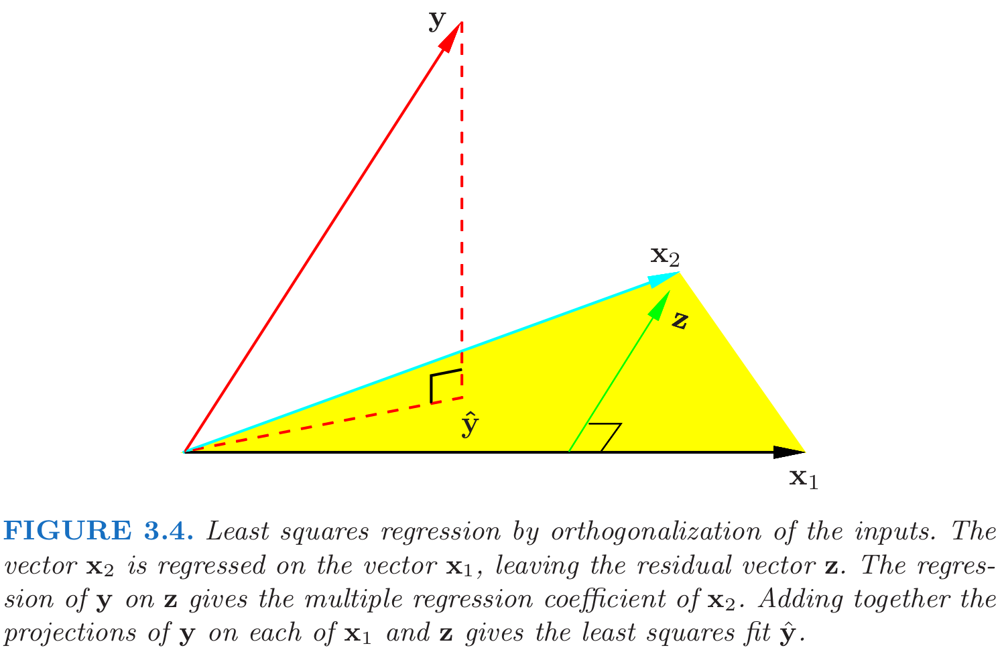
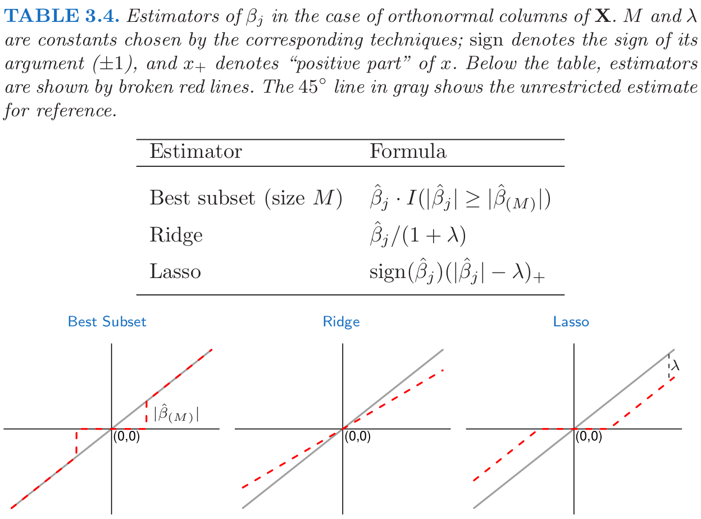
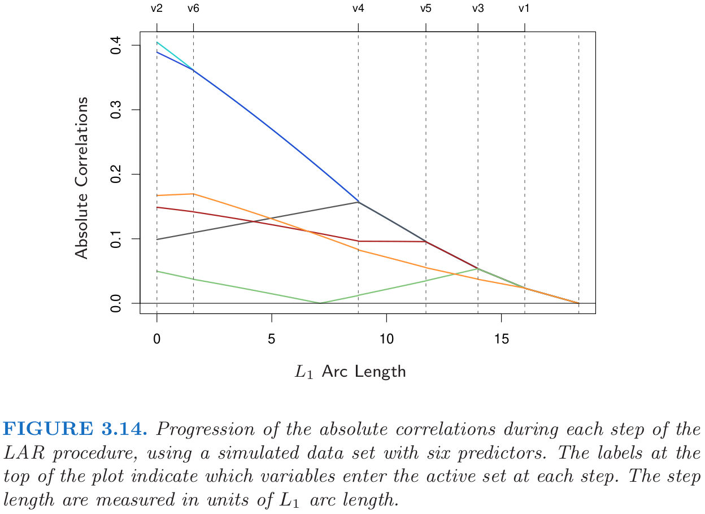

<!-- 
 -->

# **Linear Methods for Regression**

## **Linear regression model**
- Assuming that the regression function $E(Y|X)$ is linear in the inputs $X_1,...,X_p$.
- Simple and provide an adequate and interpretable description of how the inputs affect the output.
- Outperform in small numbers training cases, low signal-to-noise ratio or sparse data.
- In Chapter 5, basis-funciton methods will be discussed.

## **Least squares**

Suppose that the regression function $E(Y|X)$ is linear, given input vector $X^T = (X_1, X_2, ..., X_p)$, real-valued output $Y$, the linear regression model has the form

$$\tag{3.1}
f(X) = \beta_0+ \sum_{j=1}^p X_j\beta_j.
$$

The variables $X_j$ can come from different sources:
- quantitative inputs and its transformations (log, square-root or square);
- basis expansions, (e.g. $X_2=X_1^2, X_3 = X_1^3$, a polynomial representation);
- numeric or "dummy" coding of the levels of qualitative inputs.
- interactions between variables (e.g. $X_3=X_1X_2$)

Suppose we have a set of training data $(x_1, y_1), ..., (x_N, y_N)$ to estimate the parameters $\beta$, where $x_i= (x_{i1}, x_{i2}, ..., x_{ip})^T$, the least squares minimize the residual sum of squares (RSS)
$$\tag{3.2}
\begin{aligned}
\text{RSS}(\beta) &= \sum_{i=1}^N(y_i-f(x_i))^2 \\
&= \sum_{i=1}^N(y_i-\beta_0-\sum_{j=1}^px_{ij}\beta_j)^2 \\
&= (\mathbf{y}-\mathbf{X}\beta)^T(\mathbf{y}-\mathbf{X}\beta).
\end{aligned}
$$

**Statistical point of view**

- this criterion is reasonable if $(x_i, y_i)$ independent random draws from their population;
- or if the $y_i$'s are conditionally independent given the inputs $x_i$;
- the criterion measures the average lack of fit.

**The columns of $\mathbf{X}$ are linearly independent**
If $\mathbf{X}$ has full column rank, and hence $\mathbf{X}^T\mathbf{X}$ is positive definite, we can obtain the unique solution
$$\tag{3.3}
\hat{\beta} = (\mathbf{X}^T\mathbf{X})^{-1}\mathbf{X}^T\mathbf{y}.
$$

The predicted values at an input vector $x_0$ are given by $\hat{f}(x_0)=(1:x_0)^T\hat{\beta}$; the fitted values at the training inputs are
$$\tag{3.4}
\hat{\mathbf{y}} = \mathbf{X}\hat{\beta} = \mathbf{X}(\mathbf{X}^T\mathbf{X})^{-1}\mathbf{X}^T\mathbf{y}, 
$$
where $\hat{y}_i = \hat{f}(x_i)$. The matrix $\mathbf{H} = \mathbf{X}(\mathbf{X}^T\mathbf{X})^{-1}\mathbf{X}^T$ is sometimes called the "hat" matrix. The residual vector $\mathbf{y}-\hat{\mathbf{y}}$ is orthogonal to this subspace.

**The columns of $\mathbf{X}$ are not linearly independent**

(e.g. $x_2=3x_1$)

- $\mathbf{X}^T\mathbf{X}$ is singular and $\hat{\beta}$ are not uniquely defined.
- $\hat{\mathbf{y}}=\mathbf{X}\hat{\beta}$ are still the projection of $\mathbf{y}$ onto the column space of $\mathbf{X}$ (just more than one way to express). 
- The non-full-rank case occurs most often when one or more qualitative inputs are coded in a redundant fashion.
- There is usually a natural way to resolve the non-unique representation, by recoding and/or dropping redundant columns in $\mathbf{X}$. (most regression software packages detect and removing them automatically)
- In image or signal analysis, sometimes $p > N$ (rank deficiencies), the features can be reduced by filtering or regularization (Section 5.2.3 and Chapter 18.)

**The sampling properties of $\hat{\beta}$**

We now assume that the observations $y_i$ are uncorrelated and have constant variance $\sigma^2$, and that the $x_i$ are fixed (non random). The variance-covariance matrix of the least squares parameter estimates is 

$$\tag{3.5}
Var(\hat{\beta}) = (\mathbf{X}^T\mathbf{X})^{-1}\sigma^2.
$$

Typically one estimates the variance $\sigma^2$ unbiased by
$$\tag{3.6}
\hat{\sigma}^2 = \frac{1}{N-p-1}\sum_{i=1}^N(y_i-\hat{y}_i)^2.
$$
(3.6) can be shown with the following assumption (In fact, the noise could not be Gaussian).

We now assume that (3.1) is the correct model, and the deviations of $Y$ around its expectation are additive and Gaussian,hence 
$$\tag{3.7}
Y= \beta_0+\sum_{j=1}^pX_j\beta_j +\varepsilon, 
$$
where the error $\varepsilon\sim N(0,\sigma^2)$. It is easy to show that 

$$\tag{3.8}
\hat{\beta}\sim N(\beta, (\mathbf{X}^T\mathbf{X})^{-1}\sigma^2).
$$

This is a multivariate normal distribution with mean vector and variance–covariance matrix as shown. Also

$$\tag{3.9}
(N-p-1)\hat{\sigma}^2 \sim \sigma^2 \mathcal{X}^2_{N-p-1}.
$$
In addition $\hat{\beta}$ and $\hat{\sigma}^2$ are statistically independent.

> *proof of (3.6).*   
>  First note that 
> $$\sum_{i=1}^N(y_i-\hat{y}_i)^2 =\|\mathbf{y}-\mathbf{X}\hat{\beta}\|^2.$$
> We have
> $$
\begin{aligned}
\mathbf{y}-\mathbf{X}\hat{\beta} &= \mathbf{X}\beta+\varepsilon- \mathbf{X}(\mathbf{X}^T\mathbf{X})^{-1}\mathbf{X}^T(\mathbf{X}\beta+\varepsilon)\\
&=(I_N-H)\varepsilon 
\end{aligned} $$ 
> Hence, 
> $$ E(\|\mathbf{y}-\mathbf{X}\hat{\beta}\|^2) = E(\varepsilon^T(I_N-H)^T(I_N-H)\varepsilon)= E(\varepsilon^T(I_N-H)\varepsilon) $$
> Note that 
> $$
\varepsilon^T(I_N-H)\varepsilon = \sum_{i,j}\varepsilon_i\varepsilon_j(\delta_{ij}-H_{ij}) $$
>Thus, 
> $$
\begin{aligned}
E(\|\mathbf{y}-\mathbf{X}\hat{\beta}\|^2)&=
E(\varepsilon^T(I_N-H)\varepsilon)\\
&=\sum_{i=1}^N\sigma^2(\delta_{ii}-H_{ii})\\ 
&= \sigma^2(N-\text{trace}(H))\\
&= \sigma^2(N-p-1)
\end{aligned} $$

> *proof of (3.8).*  
> Since $\varepsilon\sim N(0, \sigma^2)$, then $\hat{\beta}$ is normal distribution,
> $$\begin{aligned}
E(\hat{\beta}) &= E((\mathbf{X}^T\mathbf{X})^{-1}\mathbf{X}^T \mathbf{y})\\
&= E((\mathbf{X}^T\mathbf{X})^{-1}\mathbf{X}^T (\mathbf{X}\beta+\varepsilon))\\
&=\beta\end{aligned}$$ 
> and
> $$
Var(\hat{\beta}) = Var((\mathbf{X}^T\mathbf{X})^{-1}\mathbf{X}^T\mathbf{y}) = (\mathbf{X}^T\mathbf{X})^{-1}\sigma^2 
$$

> *proof of (3.9).*  
> Since $\varepsilon\sim N(0, \sigma^2)$, from the proof of (3.6), we have
> $$
\mathbf{y}-\hat{\mathbf{y}}=\mathbf{y}-\mathbf{X}\hat{\beta} = (I_N-H)\varepsilon 
>$$
> Then, each element is normal distribution. According to the linearity of expectation, we obtain
> $$
E(\mathbf{y}-\hat{\mathbf{y}})=E(\mathbf{y}-\mathbf{X}\hat{\beta})= 0.
> $$
> From the proof of (3.6), we also have
> $$
E(\|\mathbf{y}-\hat{\mathbf{y}}\|^2)= E(\|\mathbf{y}-\mathbf{X}\hat{\beta}\|^2) = \sigma^2(N-p-1)
>$$
> Thus,  $(N-p-1)\hat{\sigma}^2\sim \sigma^2 \mathcal{X}^2_{N-p-1}$.

In addition $\hat{\beta}$ and $\hat{\sigma}^2$ are independent (In normal distribution, sample mean and sample variance are independent, refer it to prove that). To test the hypothesis that a particular coefficient $\beta_j=0$, we form the standardized coefficient or $Z$-score
$$\tag{3.10}
z_j = \frac{\hat{\beta}_j}{\hat{\sigma}\sqrt{v_j}}, \quad v_j \text{ is the $j$th diagonal element of $(\mathbf{X}^T\mathbf{X})^{-1}$.}
$$

- $z_j\sim t_{N-p-1}$
- a large (absolute) value of $z_j$ will lead to rejection of this null hypothesis.
- If $\hat{\sigma}$ is replaced by a known value $\sigma$, then $z_j\sim N(0,1)$. The tail quantitles of $t$-distribution and a standard normal become negligible as the sample size increases, so we can use the normal quantiles to approximate it.
- we can isolate $\beta_j$ to obtain a $1-2\alpha$ confidence interval for $\beta_j$:
  $$\tag{3.11}
    (\hat{\beta}_j-z^{(1-\alpha)}v_j^{\frac{1}{2}}\hat{\sigma}, \hat{\beta}_j+z^{(1-\alpha)}v_j^{\frac{1}{2}}\hat{\sigma}), \quad \text{$z^{(1-\alpha)}$ is the $1-\alpha$ percentile of the normal distribution.}
  $$

When we need to test for the significance of groups of coefficients simultaneously. We can use the $F$ statistic, let $\text{RSS}_1$ is the residual sum of squares for the least squares fit of the bigger model with $p_1+1$ parameters, and $\text{RSS}_0$ the same for the nested smaller model with $p_0+1$ parameters, having $p_1-p_0$ parameters constrained to be zero.
$$\tag{3.12}
F= \frac{(\text{RSS}_0-\text{RSS}_1)/(p_1-p_0)}{\text{RSS}_1/(N-p_1-1)},
$$
The $F$ statistic measures the change in residual sum-of-squares per additional parameter in the bigger model, and it is normalized by an estimate of $\sigma^2$. Under the Gaussian assumptions, the null hypothesis that the smaller model is correct, the $F$ statistic will have a $F_{p_1-p_0,N-p_1-1}$ distribution. For large $N$, the quantiles of $F_{p_1-p_0, N-p_1-1}$ approach those of $\mathcal{X}^2_{p_1-p_0}/(p_1-p_0)$. 

(Exercise 3.1) $z_j$ are equivalent to the $F$ statistic for dropping the single coefficient $\beta_j$ from the model.

> *Proof of Exercise 3.1.*

We can obtain an approximate confidence set for the entire parameter vector $\beta$, namely
$$\tag{3.13}
C_{\ beta} = \{\beta| (\hat{\beta}-\beta)^T\mathbf{X}^T\mathbf{X}(\hat{\beta}-\beta) \leq \hat{\sigma}^2\mathcal{X}_{p+1}^2 \,^{(1-\alpha)}\}.
$$
This confidence set for $\beta$ generates a corresponding confidence set for the true function $f (x) = x^T\beta$, namely $\{x^T\beta|\beta \in C_{\beta} \}$ (Exercise 3.2).

>*proof of (3.13).*
> From (3.8), it is easy to show that
> $$
(\mathbf{X}^T\mathbf{X})^{1/2}(\hat{\beta}-\beta) \sim N(0, \sigma^2I_N). $$
> Then 
> $$
(\hat{\beta}-\beta)^T\mathbf{X}^T\mathbf{X}(\hat{\beta}-\beta) \sim \sigma^2\mathcal{X}^2_{p+1}. $$
> Combining this with (3.9), it gives
> $$
\frac{(\hat{\beta}-\beta)^T\mathbf{X}^T\mathbf{X}(\hat{\beta}-\beta)}{(p+1)\hat{\sigma}^2}\sim F_{p+1, N-p-1}. $$
> On the other hand, one can prove if $S\sim F_{m,n}, T =\lim_{n\to\infty} mS \sim \mathcal{X}^2_m$ by directly computing the limit of $mS$'s pdf, with the help of relation between gamma function and beta function and Stirling's formula. With this claim, we have
> $$
\frac{(\hat{\beta}-\beta)^T\mathbf{X}^T\mathbf{X}(\hat{\beta}-\beta)}{\hat{\sigma}^2}\sim \mathcal{X}^2_{p+1}\quad (N\to \infty).
$$

*Example: Prostate Cancer (Page 50).*

## **The Gauss-Markov Theorem**

**The least squares estimates of the parameters $\beta$ have the smallest variance among all linear unbiased estimates.**

We focus on estimation of any linear combination of the parameters $\theta= a^T\beta$. The least squares estimte of $a^T\beta$ is 
$$\tag{3.14}
\hat{\theta} = a^T\hat{\beta} = a^T(\mathbf{X}^T\mathbf{X})^{-1}\mathbf{X}^T\mathbf{y}.
$$

Considering $\mathbf{X}$ to be fixed, this is a linear function $\mathbf{c}_0^T\mathbf{y}$ of the response vector $\mathbf{y}$. If we assume that the linear model is correct, $a^T\hat{\beta}$ is unbiased since
$$\tag{3.15}
\begin{aligned}
E(a^T\hat{\beta}) &= E(a^T(\mathbf{X}^T\mathbf{X})^{-1}\mathbf{X}^T\mathbf{y})\\
& = a^T(\mathbf{X}^T\mathbf{X})^{-1}\mathbf{X}^T\mathbf{X}\beta\\
& = a^T\beta.
\end{aligned}
$$

(Exercise 3.3) The Gauss-Markov theorem states that if we have any other linear estimator $\tilde{\theta} = \mathbf{c}^T\mathbf{y}$ that is unbiased for $a^T\beta$, then 
$$\tag{3.16}
Var(a^T\hat{\beta}) \leq Var(\mathbf{c}^T\mathbf{y}).
$$
For simplicity we have stated the result in terms of estimation of a single parameter $a^T\beta$, but with a few more definitions one can state it in terms of the entire parameter vector $\beta$ (Exercise 3.3).

> *Proof of Exercise 3.3*

Consider the mean squared error of an estimator $\tilde{\theta}$ in estimating $\theta$:
$$\tag{3.17}
\text{MSE}(\tilde{\theta}) = E(\tilde{\theta}-\theta)^2 = Var(\tilde{\theta}) + (E(\tilde{\theta})-\theta)^2.
$$
There may well exist a biased estimator with smaller mean squared error, such an estimator would trade a little bias for a larger reduction in variance. Any method that shrinks or sets to zero some of the least squares coefficients may result in a biased estimate.

Mean squared error is intimately related to prediction accuracy, as discussed in Chapter 2. Consider the prediction of the new response at input $x_0$, $Y_0=f(x_0)+\varepsilon_0$. Then the expected prediciton error (EPE) of an estimate $\tilde{f}(x_0)=x_0^T\tilde{\beta}$ is 
$$\tag{3.18}
E(Y_0-\tilde{f}(x_0))^2 = E(x_0^T\tilde{\beta}-f(x_0))^2 + \sigma^2 = \text{MSE}(\tilde{f}(x_0))+ \sigma^2.
$$
Therefore, expected prediction error and mean squared error differ only by
the constant $\sigma^2$.

## **Multiple Regression from Simple Univariate Regression**

The linear model with $p>1$ inputs is called the *multiple linear regression model*. $p=1$ called *univariate* linear model. 

In convenient vector notation, let $\mathbf{y} = (y_1,...,y_N)^T, \mathbf{x} = (x_1,...,x_N)^T$, Then the univariate linear model with no intercepte ($Y=X\beta+\varepsilon$) have least squares estimate and residuals:
$$\tag{3.19}
\begin{aligned}
\hat{\beta}  &= \frac{\langle \mathbf{x}, \mathbf{y} \rangle}{\langle \mathbf{x}, \mathbf{x} \rangle}, \\
\mathbf{r}  &=  \mathbf{y} - \mathbf{x} \hat{\beta}.
\end{aligned}
$$

Suppoose that the inputs $\mathbf{x}_1,\mathbf{x}_2, ..., \mathbf{x}_p$ (the columns of the data matrix $\mathbf{X}$) are orthogonal; Then the mutiple least squares estimates $\hat{\beta}_j$ are equal to $\langle \mathbf{x}_j, \mathbf{y} \rangle / \langle \mathbf{x}_j, \mathbf{x}_j \rangle$.

Orthogonal inputs occur most often with balanced, designed experiments(where orthogonality is enforced), but almost never with observationaldata. Hence we will have to orthogonalize them in order to carry this idea further.

**Gram-Schmidt Procedure**

---
**Algorithm 3.1** *Regression by Successive Orthogonalization.*

---
1. Initialize $\mathbf{z}_0=\mathbf{x}_0=\mathbf{1}$.
2. For $j=1,2,...,p$
   
   Regress $\mathbf{x}_j$ on $\mathbf{z}_0, \mathbf{z}_1, ..., \mathbf{z}_{j-1}$ to produce coefficients $\hat{\gamma}_{\ell j}= \langle \mathbf{z}_{\ell}, \mathbf{x}_j\rangle / \langle \mathbf{z}_{\ell}, \mathbf{z}_{\ell} \rangle,\ell = 0,...,j-1$ and residual vector $\mathbf{z}_j = \mathbf{x}_j-\sum_{k=0}^{j-1}\hat{\gamma}_{kj}\mathbf{z}_k$.
3. Regress $\mathbf{y}$ on the residual $\mathbf{z}_p$ to give the estimate $\hat{\beta}_p$.

---

- The result of this algorithm is 
$$\tag{3.20}
\hat{\beta}_p=\frac{\langle \mathbf{z}_p, \mathbf{y} \rangle}{\langle \mathbf{z}_p, \mathbf{z}_p \rangle}.
$$
- The inputs $\mathbf{z}_0, \mathbf{z}_1,..., \mathbf{z}_{j-1}$ in step 2 are orthogonal.
- Since $\mathbf{z}_p$ alone involves $\mathbf{x}_p$ (with coefficient 1), the coefficient (3.20) is indeed the coefficient of $\mathbf{y}$ on $\mathbf{x}_p$.
- By rearranging the $\mathbf{x}_j$, any one of them could be in the last position, and a similar results holds.
- (Exercise 3.4) show that how the vector of least squares coefficients can be obtained from a single pass of the Gram–Schmidt procedure(Algorithm 3.1).
  > *Proof of Exercise 3.4.*
- From (3.20) we also obtain an alternate formula for the variance estimates (3.5), 
  $$\tag{3.21}
    Var(\hat{\beta}_p) = \frac{\sigma^2}{\langle \mathbf{z}_p, \mathbf{z}_p\rangle} = \frac{\sigma^2}{\|\mathbf{z}_p\|^2}.
  $$ 

   The precision with wich we can estimate $\hat{\beta}_p$ depends on the length of the residual vector $\mathbf{z}_p$; this represents how mush of $\mathbf{x}_p$ is unexplained by the other $\mathbf{x}_k$'s.

## **Multiple outputs**

Suppose we have multiple ouputs $Y_1, Y_2, ..., Y_K$ that we wish to predict from our inputs $X_0, X_1, X_2, ..., X_p$. We assume a linear model for each output
$$\tag{3.22}
Y_k  = f_k(X)+\varepsilon_k = \beta_{0k} + \sum_{j=1}^pX_j\beta_{jk}+\varepsilon_k
$$

With $N$ training cases we can writhe the model in matrix notation
$$\tag{3.23}
\mathbf{Y}  = \mathbf{X}\mathbf{B} + \mathbf{E}.
$$
Here $\mathbf{Y}$ is the $N\times K$ response matrix, with $ik$ entry $y_{ik}$, $\mathbf{X}$ is the $N\times (p+1)$ input matrix, $\mathbf{B}$ is the $(p+1) \times K$ matrix of parameters and $\mathbf{E}$ is the $N\times K$ matrix of errors. The residual sum of squares
$$\tag{3.24}
\text{RSS}(\mathbf{B}) = \sum_{k=1}^K\sum_{i=1}^N(y_{ik}-f_k(x_i))^2 = \text{trace}((\mathbf{Y}-\mathbf{X}\mathbf{B})^T(\mathbf{Y}-\mathbf{X}\mathbf{B})).
$$
The least squares estimates have exactly the same form as before
$$\tag{3.25}
\mathbf{\hat{B}} = (\mathbf{X}^T\mathbf{X})^{-1}\mathbf{X}^T\mathbf{Y}.
$$
Hence the coefficients for the $k$th outcome are just the least squares estimates in the regression of $\mathbf{y}_k$ on $\mathbf{x}_0, \mathbf{x}_1,...,\mathbf{x}_p$. Multiple outputs do not affect one another’s least squares estimates.

If the errors $\varepsilon = (\varepsilon_1,...,\varepsilon_K )$ in (3.22) are correlated, then it might seem appropriate to modify (3.24) in favor of a multivariate version. Specifically, suppose $Cov(\varepsilon) = \mathbf{\Sigma}$, then the multivariate weighted criterion

$$\tag{3.26}
\text{RSS}(\mathbf{B}) = \sum_{i=1}^N(y_{i}-f(x_i))^T\mathbf{\Sigma}^{-1}(y_{i}-f(x_i))
$$

arises naturally from multivariate Gaussian theory. Here $f(x)$ is the vector function $(f_1(x), ..., f_K(x))^T$, and $y_i$ the vector of $K$ responses for observation $i$.

(Exercise 3.11) The solution is given by (3.25); $K$ separate regressions that ignore the correlations. If the $\mathbf{\Sigma}_i$ vary among observations, then the solution for $\mathbf{B}$ no longer decouples. 

  > *Proof of Exercise 3.11.*

(Section 3.7 pursue the multiple outcome problem.)

## **Subset Selection**
**Motivation:** We are oftern not satisfied with the least squares estimates because  of prediction accuracy (low bias but large variance) and interpretation (we would like to determine a smaller subset that exhibit the strongest effects).

The subset selection and controling variance method all fall under the general heading *model selection*. With subset selection we retain only a subset of the variables, and eliminate the rest from the model. 

### **Best-Subset Selection**
- **Best subset regression finds for each $k\in\{0, 1, 2, . . . , p\}$ the subset of size $k$ that gives smallest residual sum of squares.** (*leaps and bounds procedure——makes this feasible for $p$ as large as 30 or 40*) 
- The best-subset curve is necessarily decreasing, so cannot be used to select the subet size $k$.
- There are a number of criteria that one may use; typically we choose the smallest model that minimizes an estimate of the expected prediction error.
- AIC criterion and cross-validation (Chapter 7)
### **Forward-Stepwise Selection**
- **Forward-stepwise selection starts with the intercept, and then sequentially adds into the model the predictor that most improves the fit.**
- Exploit the QR decomposition for the current fit to rapidly establish the next candidate (Exercise 3.9). 
  > Exercise 3.9
- Sub-optimal, greedy algorihtm
- Advantage: Computational (for large $p$), Statistical (lower variance, but more bias.)
### **Backward-Stepwise Selection**
- **Backward-stepwise selection starts with the full model, and sequentially deletes the predictor that has the least impact on the fit.**
- The candidate for dropping is the variable with the smallest Z-score (Exercise 3.10). 
  > Exercise 3.10
- only be used when $N>p$, while forward step wise can always be used.

Software packages implement hybrid stepwise-selection (select best of forward and backward, AIC score). Some traditional packages base the selection on $F$-statistics adding "significant" terms and dropping "non-significant" terms.

### **Forward-Stagewise Regression**
- More constrained than forward-stepwise regression
- It starts like forward-stepwise regression, with an intercept equal to $\bar{y}$, and centered predictors with coefficients initially all $0$. At each step the algorithm identifies the variable most correlated with the current residual. It then computes the simple linear regression coefficient of the residual on this chosen variable, and then adds it to the current co- efficient for that variable. This is continued till none of the variables have correlation with the residuals—i.e. the least-squares fit when $N > p$.
- Forrward stagewise can take many more than $p$ steps to reach the least squares fit, and historically has been dismissed as being inefficient.
- The other variables can be adjusted when a term is added.
- "Slow fitting" in high-dimensional problems (Section 3.8.1).

*Example: Prostate Cancer (Continued) (Page 61).*

## **Shrinkage Methods**

Subset selection produces is interpretable and has possibly lower prediction error than the full model. However, it is a discrete process (variables are either retained or discarded-> high variance). Shrinkage methods are more continuous, and don't suffer as much from high variability.

### **Ridge Regression**
Ridge regression shrinks the regression coefficients by imposing a penalty on their size, 
$$\tag{3.27}
\hat{\beta}^{\text{ridge}} = \argmin_{\beta} \bigg\{\sum_{i=1}^N(y_i-\beta_0-\sum_{j=1}^px_{ij}\beta_j)^2+\lambda \sum_{j=1}^p\beta_j^2\bigg\}.
$$
Here $\lambda\geq 0$ is a complexity parameter that controls the amount of shrinkage: the larger the value of $\lambda$, the greater the amount of shrinkage. An equivalent way to write the ridge problem is 
$$\tag{3.28}
\begin{aligned}
\hat{\beta}^{\text{ridge}} = \argmin_{\beta} &\sum_{i=1}^N\bigg(y_i-\beta_0-\sum_{j=1}^px_{ij}\beta_j\bigg)^2.\\
\text{subject to} &\sum_{j=1}^p\beta_j^2 \leq t.
\end{aligned}$$

- There is a one-to-one correspondence between the parameters $\lambda$ and $t$. 
- When there are many correlated variables in a linear regression model, their coefficients can become poorly determined and exhibit high variance.
- The ridge solutions are not equivariant under scaling of the inputs, and so one normally standardizes the inputs before solving (3.27).
- (Exercise 3.5) The solution to (3.27) can be separated into two parts, after reparametrization using centered inpus. We estimate $\beta_0$ by $\bar{y}$. The remaining coefficients get estimated by a ridge regression without intercept, using the centered $x_{ij}$. Henceforce, onece the centering has been donw, the input matrix $\mathbf{X}$ has $p$ columns.

  The criterion in (3.27) in matrix form, 
  $$\tag{3.29}
  \text{RSS}(\lambda) = (\mathbf{y}-\mathbf{X}\beta)^T(\mathbf{y}-\mathbf{X}\beta) + \lambda \beta^T\beta,
  $$ 
  the ridge regression solutions are easily seen to be 
  $$\tag{3.30}
  \hat{\beta}^{\text{ridge}} = (\mathbf{X}^T\mathbf{X}+\lambda I_p)^{-1}\mathbf{X}^T\mathbf{y},
  $$
  The problem is nonsigular since the solution add a positive constant to the disgonal of $\mathbf{X}^T\mathbf{X}$.
  > Exercise 3.5
- (Exercise 3.6) Ridge regression can also be derived as the mean or mode of a posterior distribution, with a suitably chosen prior distribution.
  > Exercise 3.6 (Note: the mode of the posterior distribution is also posterior mean for the normal distribution.)

**SVD Insights**

The SVD of the $N\times p$ matrix $\mathbf{X}$ has the form
$$\tag{3.31}
\mathbf{X} = \mathbf{U}\mathbf{D}\mathbf{V}^T.
$$
Here $\mathbf{U}$ and $\mathbf{V}$ span the column space and row space of $\mathbf{X}$, respectively. We can write the least fitted vector as 
$$\tag{3.32}
\mathbf{X} \hat{\beta}^{\text{ls}} = \mathbf{X}(\mathbf{X}^T\mathbf{X})^{-1}\mathbf{X}^T\mathbf{y}= \mathbf{U}\mathbf{U}^T\mathbf{y}.
$$
Note that $\mathbf{U}^T\mathbf{y}$ are the coordinates of $\mathbf{y}$ with respect to the rothonormal basis $\mathbf{U}$. $\mathbf{Q}$ and $\mathbf{U}$ are generally different orthogonal bases for the column space of $\mathbf{X}$ (Exercise 3.8, refer to Exercis 3.4).
> Exercise 3.8

The ridge solutions are 
$$\tag{3.33}
  \hat{\beta}^{\text{ridge}} = (\mathbf{X}^T\mathbf{X}+\lambda I_p)^{-1}\mathbf{X}^T\mathbf{y} = \sum_{j=1}^p \mathbf{u}_j\frac{d_j^2}{d_j^2+\lambda}\mathbf{u}_j^T\mathbf{y},
$$
where $\mathbf{u}_j$ are the columns of $\mathbf{U}$. Factors $d_j^2/(d_j^2+\lambda) \leq 1$. This means that a greater amount of shrinkage is applied to the coordinates of basis vectors with smaller $d_j^2$. 

The columns of $\mathbf{V}$ are called the principal components directions of $\mathbf{X}$. The first principal compnent direction $v_1$ has the property that $\mathbf{z}_1 = \mathbf{X}v_1$ has the largest sample variance amongst all normalized linear combinations of the columns of $\mathbf{X}$. From the fact that the first principal component $\mathbf{z}_1=\mathbf{X}v_1=\mathbf{u}_1d_1$ ($\mathbf{u}_1$ is the normalized first principal component), this sample variance is easily seen to be 
$$\tag{3.34}
Var(\mathbf{z}_1) = Var(\mathbf{X}v_1)=\frac{d_1^2}{N}, 
$$
In fact, the centered matrix $\mathbf{X}$ has the sample covariance matrix $\mathbf{S}=\mathbf{X}^T\mathbf{X}/N$. The ridge regression shrinks these directions with small variance most.

The effective degrees of freedom of the ridge regression fit is 
$$\tag{3.35}
\begin{aligned}
\text{df}(\lambda) &= \text{trace}(\mathbf{X}(\mathbf{X}^T\mathbf{X}+\lambda I_p)^{-1}\mathbf{X}^T)\\
&= \text{trace}(\mathbf{H}_{\lambda})\\
&= \sum_{j=1}^p\frac{d_j^2}{d_j^2+\lambda}. 
\end{aligned}
$$
Of course there is always an additional one degree of freedom for the intercept, which was
removed apriori.
### **The Lasso**

The lasso (also known as *basis pursuit*) is a shrinkage method like ridge, with subtle but important differences. 
$$\tag{3.36}
\hat{\beta}^{\text{lasso}} = \argmin_{\beta} \bigg\{\frac{1}{2}\sum_{i=1}^N(y_i-\beta_0-\sum_{j=1}^px_{ij}\beta_j)^2+\lambda \sum_{j=1}^p|\beta_j|\bigg\}.
$$
Just as in ridge regreesion, we can re-parameterize the constant $\beta_0$ by standardardizing the predictors; the solutions for $\hat{\beta}_0$ is $\bar{y}$, and thereafter we fit a model without an intercept (Exercise 3.5). An equivalent way to write the lasso problem is 
$$\tag{3.37}
\begin{aligned}
\hat{\beta}^{\text{lasso}} = \argmin_{\beta} &\sum_{i=1}^N\bigg(y_i-\beta_0-\sum_{j=1}^px_{ij}\beta_j\bigg)^2.\\
\text{subject to} &\sum_{j=1}^p|\beta_j| \leq t.
\end{aligned}$$

> Exercise 3.5

In Section 3.4.4 that efficient algorithms are available for computing the entire path of solutions as $\lambda$ is varied, with the same computational cost as for ridge regression.

### **Discussion: Subset Selection, Ridge Regression and the Lasso**

- Ridge regression does a proportional shrinkage. Lasso translates each coefficient by a constant factor $\lambda$, truncating at zero. This is called “soft thresholding,” and is used in the context of wavelet-based smoothing in Section 5.9. Best-subset selection drops all variables with coefficients smaller than the $M$th largest; this is a form of “hard-thresholding.”

- We can generlize ridge regression and the lasso, and view them as Bayes estimates. Consider the criterion
  $$\tag{3.38}
  \hat{\beta}^{\text{lasso}} = \argmin_{\beta} \bigg\{\sum_{i=1}^N(y_i-\beta_0-\sum_{j=1}^px_{ij}\beta_j)^2+\lambda \sum_{j=1}^p|\beta_j|^q\bigg\}.
  $$
  - $q=0$: subset selection, cout the number of nonzero parameters.
  - $q=1$: the prior is an independent double exponential (or Laplace) distribution for each input.
  - $q<1$: the prior is not uniform in direction but concentrates more mass in the corrdinate directions.
  - $q=2$: the prior is an independent normal distribution.
  
  In this view, the lasso, ridge regression and best subset selection are Bayes estimates with different priors.
- Elastic-net penalty (Section 18.4)
  $$\tag{3.39}
  \lambda \sum_{j=1}^p(\alpha \beta^2_j+(1-\alpha)|\beta_j|).
  $$

### **Least Angle Regression (LAR)**

---
**Algorithm 3.2** *Least Angle Regression.*

---
1. Strandardize the predictors to have mean zero and unit norm. Start with the residual $\mathbf{r} = \mathbf{y} - \bar{\mathbf{y}}, \beta_1,\beta_2, ..., \beta_p =0$.
2. Find the predictor $\mathbf{x}_j$ most correlated with $\mathbf{r}$.
3. Move $\beta_j$ from $0$ towards its least-squares coefficient $\langle \mathbf{x}_j, \mathbf{r}\rangle$, until some other competitor $\mathbf{x}_k$ has as much correlation with the current residual do does $\mathbf{x}_j$.
4. Move $\beta_j$ and $\beta_k$ in the direction defined by their joint least squares coefficient of the current residual on $(\mathbf{x}_j, \mathbf{x}_k)$, until some other competitor $\mathbf{x}_l$ has as much correlation with the current residual.

    4a.(Lasso Modification) If a non-zero coefficient hits zero, drop its variable from the active set of variables and recompute the current joint least squares direction. (gives the entire lasso path)

    4b.(FS$_0$ Modification) Find the new direction by solving the constrained least squares problem
    $$
    \min_b\|\mathbf{r}-\mathbf{X}_{\mathcal{A}}b\|_2^2 \quad \text{subject to }b_js_j\geq 0, j\in \mathcal{A},
    $$
    where $s_j$ is the sign of $\langle \mathbf{x}_j, \mathbf{r} \rangle$.

5. Continue in this way until all $p$ predictors have been entered. After $\min(N-1,p)$ steps, we arrive at the full least-squares solution.

---
- LAR is intimately connected with the lasso, and in fact provides an extremely efficient algorithm for computing the entire lasso path.
- Least angle regression uses a similar strategy with Forward stepwise regressionz, but only enters “as much” of a predictor as it deserves. 
- At the first step it identifies the variable most correlated with the response. Rather than fit this variable completely, LAR moves the coefficient of this variable continuously toward its least-squares value (causing its correlation with the evolving residual to decrease in absolute value).
  
Suppose $\mathcal{A}_k$ is the active set of variables at the beginning of the $k$th step, and let $\beta_{\mathcal{A}_k}$ be the coefficient vector for these variables at this step; there will be $k-1$ nonzero values, and the one just entered will be zero. 

If $\mathbf{r}_k = \mathbf{y}-\mathbf{X}_{\mathcal{A}_k}\beta_{\mathcal{A}_k}$ is the current residual, then the direction for this step is 
  $$\tag{3.40}
  \delta_k=(\mathbf{X}_{\mathcal{A}_k}^T\mathbf{X}_{\mathcal{A}_k})^{-1}\mathbf{X}_{\mathcal{A}_k}^T\mathbf{r}_k
  $$

The coefficient profile then evolves as $\beta_{\mathcal{A}_k}(\alpha) = \beta_{\mathcal{A}_k} + \alpha\cdot \delta_k.$ 

(Exercise 3.23) verifies that the directions chosen in this fashion do what is claimed: keep the correlations tied and decreasing.
>Exercise 3.23 

If $\mathbf{\hat{f}}_k$ is the fit vector, then it evolves as $\mathbf{\hat{f}}_k(\alpha) = \mathbf{\hat{f}}_k+\alpha\cdot \mathbf{u}_k$, where $\mathbf{u}_k = \mathbf{X}_{\mathcal{A}_k}\delta_k$ is the new fit direction.

(Exercise 3.24) $\mathbf{u}_k$ makes the smallest angle with each of the predictors in $\mathcal{A}_k$.
> Exercise 3.24

Note that we do not need to take small steps and recheck the correlations in step 3; using knowledge of the covariance of the predictors and the piecewise linearity of the algorithm, we can work out the exact step length at the beginning of each step (Exercise 3.25).
> Exercise 3.25

Least angle regression always takes $p$ steps to get to the full least squares estimates. The lasso path can have more than $p$ steps, although the two are often quite similar.

**Why lasso and LAR are so similar:**

Suppose $\mathcal{A}$ is the active set of variables at some stage in the algorithm, tied in their absolute inner-product with the current residuals, 
$$\tag{3.41}
\mathbf{x}_j^T(\mathbf{y}-\mathbf{X}\beta) = \gamma\cdot s_j,\quad \forall j\in \mathcal{A},
$$
where $s_j\in\{-1,1\}$, and $\gamma$ is the common value. Also $|\mathbf{x}_k^T(\mathbf{y}-\mathbf{X}\beta)|\leq \gamma \quad \forall k\notin \mathcal{A}$. Let $\mathcal{B}$ be the active set of variables in the solution for a given value of $\lambda$. The stationarity conditions of lasso problem (3.36) give 
$$\tag{3.42}
\mathbf{x}_j^T(\mathbf{y}-\mathbf{X}\beta) = \gamma\cdot \text{sign}(\beta_j),\quad \forall j\in \mathcal{B}.
$$
Non-activate require that 
$$\tag{3.43}
|\mathbf{x}_k^T(\mathbf{y}-\mathbf{X}\beta)|\leq \lambda, \quad \forall k\notin \mathcal{B},
$$
which again agrees with the LAR algorithm.

(Exercise 3.27) shows that these equations imply a piecewise-linear coefficient profile as λ decreases.
> Exercise 3.27

**Degrees-of-Freedom Formula for LAR and Lasso**