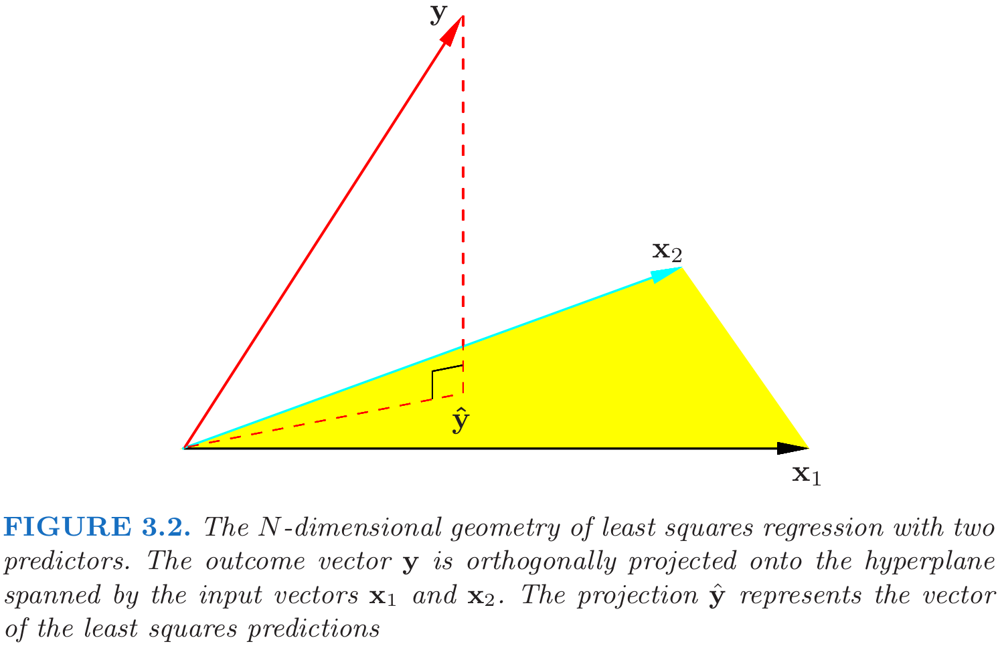

<!-- 
 -->

# **Linear Methods for Regression**

## Linear regression model
- Assuming that the regression function $E(Y|X)$ is linear in the inputs $X_1,...,X_p$.
- Simple and provide an adequate and interpretable description of how the inputs affect the output.
- Outperform in small numbers training cases, low signal-to-noise ratio or sparse data.
- In Chapter 5, basis-funciton methods will be discussed.

## Least squares

Suppose that the regression function $E(Y|X)$ is linear, given input vector $X^T = (X_1, X_2, ..., X_p)$, real-valued output $Y$, the linear regression model has the form

$$\tag{3.1}
f(X) = \beta_0+ \sum_{j=1}^p X_j\beta_j.
$$

The variables $X_j$ can come from different sources:
- quantitative inputs and its transformations (log, square-root or square);
- basis expansions, (e.g. $X_2=X_1^2, X_3 = X_1^3$, a polynomial representation);
- numeric or "dummy" coding of the levels of qualitative inputs.
- interactions between variables (e.g. $X_3=X_1X_2$)

Suppose we have a set of training data $(x_1, y_1), ..., (x_N, y_N)$ to estimate the parameters $\beta$, where $x_i= (x_{i1}, x_{i2}, ..., x_{ip})^T$, the least squares minimize the residual sum of squares (RSS)
$$\tag{3.2}
\begin{aligned}
\text{RSS}(\beta) &= \sum_{i=1}^N(y_i-f(x_i))^2 \\
&= \sum_{i=1}^N(y_i-\beta_0-\sum_{j=1}^px_{ij}\beta_j)^2 \\
&= (\mathbf{y}-\mathbf{X}\beta)^T(\mathbf{y}-\mathbf{X}\beta).
\end{aligned}
$$

**Statistical point of view**

- this criterion is reasonable if $(x_i, y_i)$ independent random draws from their population;
- or if the $y_i$'s are conditionally independent given the inputs $x_i$;
- the criterion measures the average lack of fit.

**The columns of $\mathbf{X}$ are linearly independent**
If $\mathbf{X}$ has full column rank, and hence $\mathbf{X}^T\mathbf{X}$ is positive definite, we can obtain the unique solution
$$\tag{3.3}
\hat{\beta} = (\mathbf{X}^T\mathbf{X})^{-1}\mathbf{X}^T\mathbf{y}.
$$

The predicted values at an input vector $x_0$ are given by $\hat{f}(x_0)=(1:x_0)^T\hat{\beta}$; the fitted values at the training inputs are
$$\tag{3.4}
\hat{\mathbf{y}} = \mathbf{X}\hat{\beta} = \mathbf{X}(\mathbf{X}^T\mathbf{X})^{-1}\mathbf{X}^T\mathbf{y}, 
$$
where $\hat{y}_i = \hat{f}(x_i)$. The matrix $\mathbf{H} = \mathbf{X}(\mathbf{X}^T\mathbf{X})^{-1}\mathbf{X}^T$ is sometimes called the "hat" matrix. The residual vector $\mathbf{y}-\hat{\mathbf{y}}$ is orthogonal to this subspace.

**The columns of $\mathbf{X}$ are not linearly independent**

(e.g. $x_2=3x_1$)

- $\mathbf{X}^T\mathbf{X}$ is singular and $\hat{\beta}$ are not uniquely defined.
- $\hat{\mathbf{y}}=\mathbf{X}\hat{\beta}$ are still the projection of $\mathbf{y}$ onto the column space of $\mathbf{X}$ (just more than one way to express). 
- The non-full-rank case occurs most often when one or more qualitative inputs are coded in a redundant fashion.
- There is usually a natural way to resolve the non-unique representation, by recoding and/or dropping redundant columns in $\mathbf{X}$. (most regression software packages detect and removing them automatically)
- In image or signal analysis, sometimes $p > N$ (rank deficiencies), the features can be reduced by filtering or regularization (Section 5.2.3 and Chapter 18.)

**The sampling properties of $\hat{\beta}$**

We now assume that the observations $y_i$ are uncorrelated and have constant variance $\sigma^2$, and that the $x_i$ are fixed (non random). The variance-covariance matrix of the least squares parameter estimates is 

$$\tag{3.5}
Var(\hat{\beta}) = (\mathbf{X}^T\mathbf{X})^{-1}\sigma^2.
$$

Typically one estimates the variance $\sigma^2$ unbiased by
$$\tag{3.6}
\hat{\sigma}^2 = \frac{1}{N-p-1}\sum_{i=1}^N(y_i-\hat{y}_i)^2.
$$
(3.6) can be shown with the following assumption (In fact, the noise could not be Gaussian).

We now assume that (3.1) is the correct model, and the deviations of $Y$ around its expectation are additive and Gaussian,hence 
$$\tag{3.7}
Y= \beta_0+\sum_{j=1}^pX_j\beta_j +\varepsilon, 
$$
where the error $\varepsilon\sim N(0,\sigma^2)$. It is easy to show that 

$$\tag{3.8}
\hat{\beta}\sim N(\beta, (\mathbf{X}^T\mathbf{X})^{-1}\sigma^2).
$$

This is a multivariate normal distribution with mean vector and variance–covariance matrix as shown. Also

$$\tag{3.9}
(N-p-1)\hat{\sigma}^2 \sim \sigma^2 \mathcal{X}^2_{N-p-1}.
$$
In addition $\hat{\beta}$ and $\hat{\sigma}^2$ are statistically independent.

> *proof of (3.6).*   
>  First note that 
> $$\sum_{i=1}^N(y_i-\hat{y}_i)^2 =\|\mathbf{y}-\mathbf{X}\hat{\beta}\|^2.$$
> We have
> $$
\begin{aligned}
\mathbf{y}-\mathbf{X}\hat{\beta} &= \mathbf{X}\beta+\varepsilon- \mathbf{X}(\mathbf{X}^T\mathbf{X})^{-1}\mathbf{X}^T(\mathbf{X}\beta+\varepsilon)\\
&=(I_N-H)\varepsilon 
\end{aligned} $$ 
> Hence, 
> $$ E(\|\mathbf{y}-\mathbf{X}\hat{\beta}\|^2) = E(\varepsilon^T(I_N-H)^T(I_N-H)\varepsilon)= E(\varepsilon^T(I_N-H)\varepsilon) $$
> Note that 
> $$
\varepsilon^T(I_N-H)\varepsilon = \sum_{i,j}\varepsilon_i\varepsilon_j(\delta_{ij}-H_{ij}) $$
>Thus, 
> $$
\begin{aligned}
E(\|\mathbf{y}-\mathbf{X}\hat{\beta}\|^2)&=
E(\varepsilon^T(I_N-H)\varepsilon)\\
&=\sum_{i=1}^N\sigma^2(\delta_{ii}-H_{ii})\\ 
&= \sigma^2(N-\text{trace}(H))\\
&= \sigma^2(N-p-1)
\end{aligned} $$

> *proof of (3.8).*  
> Since $\varepsilon\sim N(0, \sigma^2)$, then $\hat{\beta}$ is normal distribution,
> $$\begin{aligned}
E(\hat{\beta}) &= E((\mathbf{X}^T\mathbf{X})^{-1}\mathbf{X}^T \mathbf{y})\\
&= E((\mathbf{X}^T\mathbf{X})^{-1}\mathbf{X}^T (\mathbf{X}\beta+\varepsilon))\\
&=\beta\end{aligned}$$ 
> and
> $$
Var(\hat{\beta}) = Var((\mathbf{X}^T\mathbf{X})^{-1}\mathbf{X}^T\mathbf{y}) = (\mathbf{X}^T\mathbf{X})^{-1}\sigma^2 
$$

> *proof of (3.9).*  
> Since $\varepsilon\sim N(0, \sigma^2)$, from the proof of (3.6), we have
> $$
\mathbf{y}-\hat{\mathbf{y}}=\mathbf{y}-\mathbf{X}\hat{\beta} = (I_N-H)\varepsilon 
>$$
> Then, each element is normal distribution. According to the linearity of expectation, we obtain
> $$
E(\mathbf{y}-\hat{\mathbf{y}})=E(\mathbf{y}-\mathbf{X}\hat{\beta})= 0.
> $$
> From the proof of (3.6), we also have
> $$
E(\|\mathbf{y}-\hat{\mathbf{y}}\|^2)= E(\|\mathbf{y}-\mathbf{X}\hat{\beta}\|^2) = \sigma^2(N-p-1)
>$$
> Thus,  $(N-p-1)\hat{\sigma}^2\sim \sigma^2 \mathcal{X}^2_{N-p-1}$.