<!-- 
 -->

# **4 Linear Methods for Classification**

## **4.1 Introduction**

This chapter focos on linear method for classification (the decision boundaries are linear). Suppose predictor $G(x)$ takes values in a distrete set $\mathcal{G}$, we can always divide the input space into a collection of regions labeled according to the classification. 

Suppose, there are $K$ classes, for convenience labeled $1,2,...,K$. There are several different ways in which linear decision boundaries can be found.

Given a model discriminant functions $\delta_k(x)$ for each class, and classify $x$ to the class with the largest value for its discriminant function. The regression approach and that model the posterior probabilities $\Pr(G=k|X=x)$ are the members of this class of methods as soon as the monotone transformation of $\delta_k(x)$ and $\Pr(G=k|X=x)$ are linear for the decision boundaries to be linear. 

- The regression approach: Supppose the fitted linear model for the $k$th indicator response variable is $\hat{f}_k(x)=\hat{\beta}_{k0}+\hat{\beta}_k^Tx$. The decision boundary between class $k$ and $l$ is that set of points for which $\hat{f}_k(x)=\hat{f}_{\ell}(x)$, that is the set $\{x:(\hat{\beta}_{k0}-\hat{\beta}_{\ell 0})+(\hat{\beta}_k-\hat{\beta}_{\ell})^Tx = 0\}$, an affine set or hyperplane.
- The posterior probilities: The common useful model is 
  $$\tag{4.1}
  \begin{aligned}
    \Pr(G=k|X=x) &= \frac{\exp(\beta_{k0}+\beta_k^Tx)}{1+\sum_{\ell=1}^{K-1}\exp(\beta_{\ell 0}+\beta_{\ell}^Tx)}, k = 1,..., K-1\\
     \Pr(G=K|X=x) &= \frac{1}{1+\sum_{\ell=1}^{K-1}\exp(\beta_{\ell 0}+\beta_{\ell}^Tx)}.
  \end{aligned}
  $$
  Here the monotone transformation is the *logit* trainsformation and in fact we see that 
  $$\tag{4.2}
  \log\frac{\Pr(G=k|X=x)}{\Pr(G=\ell|X=x)} = (\beta_{k0}-\beta_{\ell0})+(\beta_{k}-\beta_{\ell})^Tx.
  $$
  The decision boundary is the set of points for which the *log-odds* are zero. We discuss two very popular but different methods that result in linear log-odds or logits: linear discriminant analysis and linear logistic regression. Although they differ in their derivation, the essential difference between them is in the way the linear function is fit to the training data.
- Explicitly model the boundaries between the classes as linear: The first is the well-known *perceptron*, the second is *optimally separating hyperplane*. We treat the separable case here, and defer treatment of the nonseparable case to Chapter 12.

While this entire chapter is devoted to linear decision boundaries, there is considerable scope for generalization. For example, expand the variable set by including their squares and cross-products. This approach can be used with any basis transformation $h(X)$ where $h:\mathbb{R}^p\to \mathbb{R}^q$ with $q > p$.

## **4.2 Linear Regression of an Indicator Matrix**

Here each of the response categories are coded via an indicator variable. Then if $\mathcal{G}$ has $K$ classes, there will be $K$ such indicators $Y_k, k=1,..., K$ with $Y_k=1$ if $G=k$ else $0$. These are collected together in a vector $Y=(Y_1,..., Y_K)$, and the $N$ training instances of there form an $N\times K$ *indicator response matrix* $\mathbf{Y}$ (0-1 matrix, each row having a single 1). We fit a linear regression model to each columns of $\mathbf{Y}$ simultaneously, and the fit is given by 
$$\tag{4.3}
\hat{\mathbf{Y}}=\mathbf{X}(\mathbf{X}^T\mathbf{X})^{-1}\mathbf{X}^T\mathbf{Y}.
$$
Note that 
  - the coefficient vector for each response column $\mathbf{y}_k$;
  - the $\hat{\mathbf{B}}= (\mathbf{X}^T\mathbf{X})^{-1}\mathbf{X}^T\mathbf{Y}$ has $(p+1)\times K$ coefficients;
  - compute the fitted output $\hat{f}(x)^T= (1,x^T)\hat{\mathbf{B}}$, a $K$ vector;
  - identify the largest component and classify accordingly:
  $$\tag{4.4}
  \hat{G}(x)=\argmax_{k\in \mathcal{G}}\hat{f}_k(x).
  $$

What is the rationable for this approach? We know that the regression as an estimate of conditional expectation. So, for the random variable $Y_k$, $E(Y_k|X=x)=\Pr(G=k|X=x)$, so conditional expectation of each of the $Y_k$ seems a sensible goal. However, the $\hat{f}_k(x)$ can not be reasonable estimates of the posterior probabilities $\Pr(G=k|X=x)$ (could be negative or greater than 1). In fact on many problems it gives similar results to more standard linear methods for classification. If we allow linear regression onto basis expansions $h(X)$ of the inputs, this approach can lead to consistent estimates of the probabilities. As the size of the training set $N$ grows bigger, we adaptively include more basis elements so that linear regression onto these basis functions approaches conditional expectation. We discuss such approaches in Chapter 5.

A more simplistic viewpoint is to construct targets $t_k$ for each class, where $t_k$ is the $k$th column of the $K\times K$ identity matrix. With the same coding as before, the response vector $y_i$ ($i$th row of $\mathbf{Y}$) for observation $i$ has the value $y_k=t_k$ if $g_i=k$. We might then fit the linear model by least squares:
$$\tag{4.5}
\min_{\mathbf{B}}\sum_{i=1}^N\|y_i-[(1,x_i^T)\mathbf{B}]^T\|^2.
$$
The criterion is a sum-of-squared Euclidean distances of the fitted vectors from their targets. A new observation is classified by computing its fitted vector $\hat{f}(x)$ and classifying to the cloest target:
$$\tag{4.6}
\hat{G}(x) = \argmin_k\|\hat{f}(x)-t_k\|^2.
$$
This is exactly the same as the previous approach:
   - The closest target classification rule (4.6) is easily seen to be exactly the same as the maximum fitted component criterion (4.4).

There is a serious problem with the regression approach when the number of classes $K \geq 3$, especially prevalent when $K$ is large. Because of the rigid nature of the regression model, classes can be masked by others. See figure 4.2 and 4.3.

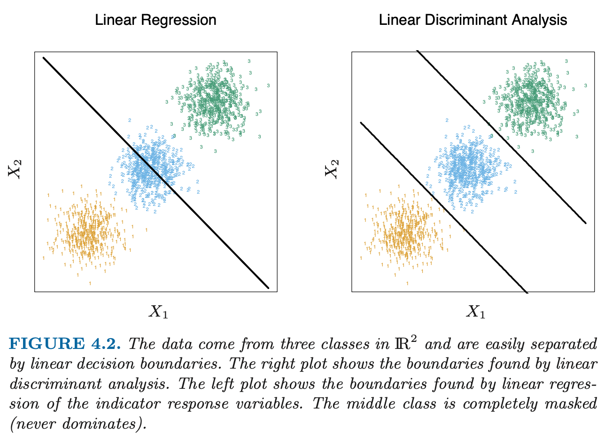

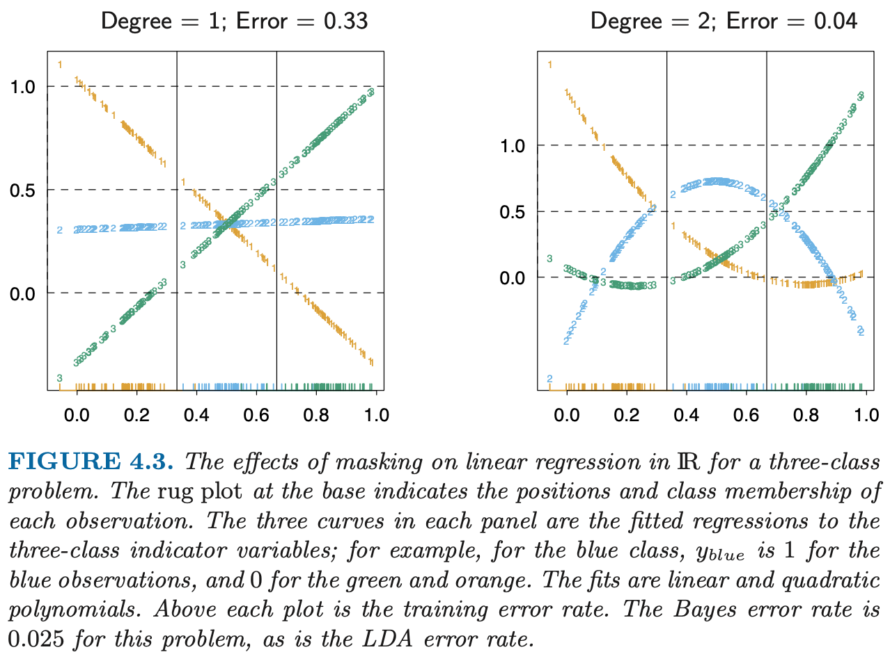

For the cases in figure 4.3, if there are $K\geq 3$ classes are lined up, polynomial terms up to degress $K-1$ might be needed to resolve them. So in $p$-dimensional input space, one would need general polynomial terms and cross-products of total degree $K − 1$, $O(p^{K−1})$ terms in all, to resolve such worst-case scenarios. The example is extreme, but for large $K$ and small $p$ such maskings naturally occur. As a more realistic illustration, Figure 4.4 is a projection of the training data for a vowel recognition problem onto an informative two-dimensional subspace.

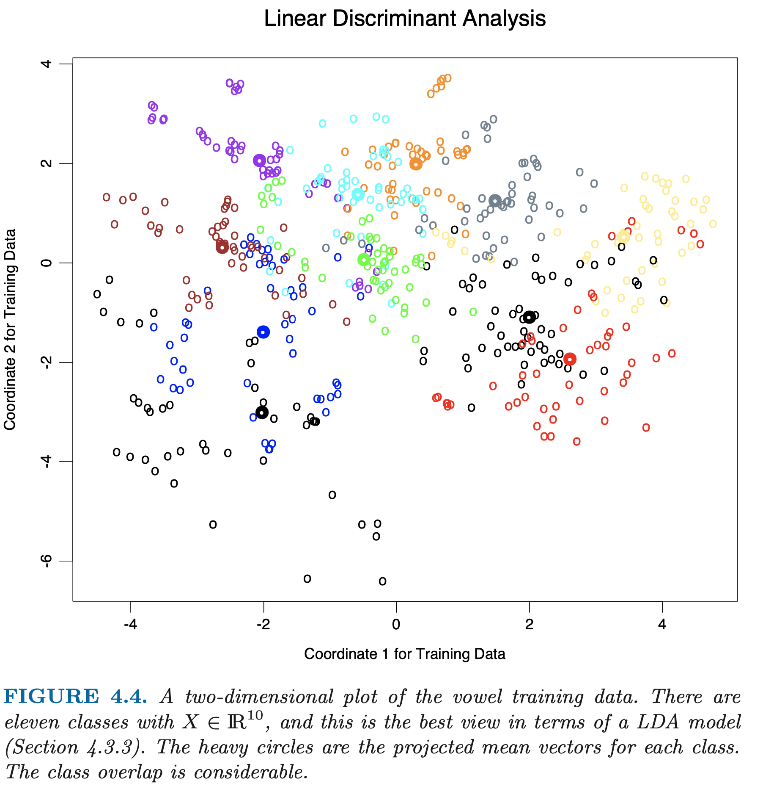

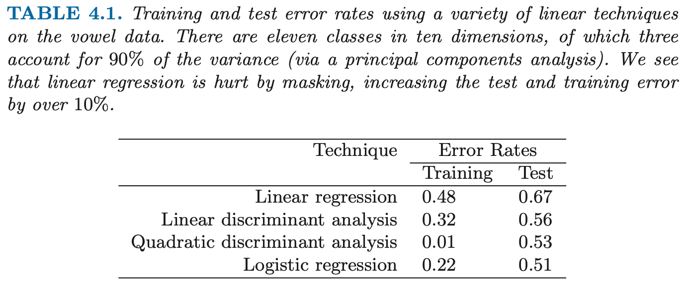

## **4.3 Linear Discriminant Analysis**

Decision theory for classification (Section 2.4) tells us that we need to know the class posteriors $\Pr(G|X)$ for optimal classification. Suppose $f_k(x)$ is the class-conditional density of $X$ in class $G=k$, and let $\pi_k$ be the prior probability of class $k$, with $\sum_{k=1}^K\pi_k=1$. A simple application of Bayes theorem gives us
$$\tag{4.7}
\Pr(G=k|X=x) = \frac{f_k(x)\pi_k}{\sum_{\ell=1}^Kf_{\ell}(x)\pi_{\ell}}.
$$
We see that in terms of ability to classify, having the $f_k(x)$ is almost equivalent to having the quantity $\Pr(G = k|X = x)$. 

Many techniques are based on models for the class densities:
  - linear and quadratic discriminant analysis use Gaussian densities;
  - more flexible mixtures of Gaussians allow for nonlinear decision boundaries (Section 6.8);
  - general nonparametric density estimates for each class density allow the most flexibility (Section 6.6.2);
  - Naive Bayes models are a variant of the previous case, and assume that each of the class densities are products of marginal densities; that is, they assume that the inputs are conditionally independent in each class (Section 6.6.3).

Suppose that we model each class density as multivariate Gaussian
$$\tag{4.8}
f_k(x) = \frac{1}{(2\pi)^{p/2}|\Sigma_k|^{1/2}}e^{-\frac{1}{2}(x-\mu_k)^T\Sigma_k^{-1}(x-\mu_k)}.
$$

Linear discriminant analysis (LDA) arises in the special case when we assume that the classes have a common covariance matrix $\Sigma_k=\Sigma \quad \forall k$. In comparing two classes $k$ and $\ell$, it is sufficient to look at the log-ratio, and we see that
$$\tag{4.9}
\begin{aligned}
\log \frac{\Pr(G=k|X=x)}{\Pr(G=\ell|X=x)} &= \log\frac{f_k(x)}{f_{\ell}(x)}+\log\frac{\pi_k}{\pi_{\ell}}\\
&=\log\frac{\pi_k}{\pi_{\ell}}-\frac{1}{2}(\mu_k+\mu_{\ell})^T\Sigma^{-1}(\mu_k-\mu_{\ell})+x^T\Sigma^{-1}(\mu_k-\mu_{\ell}),
\end{aligned}
$$
an equation linear in $x$. For any pair of classes $k,\ell$, the decision boundary is the set where $\Pr(G=k|X=x)=\Pr(G=\ell|X=x)$ is linear in $x$; in $p$ dimensions a hyperplane. Figure 4.5 shows an example with three classes from three Gaussian distributions with a common covariance matrix and $p=2$. 

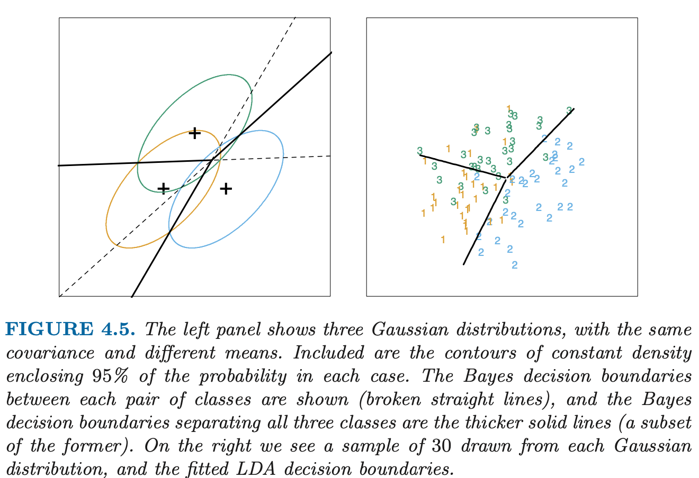

Notice that the decision boundaries are not the perpendicular bisectors of the line segments joining the centroids. This (perpendicular) would be the case if the covariance $\Sigma$ were spherical $\sigma^2\mathbf{I}$, and the class priors were equal. From (4.9) we see that *linear discriminant functions*

$$\tag{4.10}
\delta_k(x) = x^T\Sigma^{-1}\mu_k-\frac{1}{2}\mu_k^T\Sigma^{-1}\mu_k+\log \pi_k
$$
are an equivalent description of the decision rule, with $G(x)=\argmax_k\delta_k(x)$.

In practice we do not know the parameters of the Gaussian distributions, and will need to estimate them using our training data:
  - $\hat{\pi}_k=N_k/N$, where $N_k$ is the number of class-$k$ observations;
  - $\hat{\mu}_k=\sum_{g_i=k}x_i/N_k$;
  - $\hat{\Sigma} = \sum_{k=1}^K\sum_{g_i=k}(x_i-\hat{\mu}_k)(x_i-\hat{\mu}_k)^T/(N-K)$.

**With two classes**, the LDA rule classifies to class 2 if 
$$\tag{4.11}
x^T\hat{\Sigma}^{-1}(\hat{\mu}_2-\hat{\mu}_1)>\frac{1}{2}(\hat{\mu}_2+\hat{\mu}_1)^T\Sigma^{-1}(\hat{\mu}_2-\hat{\mu}_1)-\log(N_2/N_1).
$$
Suppose we code the targets in the two classes as +1 and −1, respectively. It is easy to show that the coefficient vector from least squares is proportional to the LDA direction given in (4.11) (Exercise 4.2). [In fact, this correspondence occurs for any (distinct) coding of the targets; see Exercise 4.2]. However unless $N_1 = N_2$ the intercepts are different and hence the resulting decision rules are different.

> Exercise 4.2.

Since this derivation of the LDA direction via least squares does not use a Gaussian assumption for the features, its applicability extends beyond the realm of Gaussian data. However the derivation of the particular intercept or cut-point given in (4.11) does require Gaussian data. Thus it makes sense to instead choose the cut-point that empirically minimizes training error for a given dataset. This is something we have found to work well in practice, but have not seen it mentioned in the literature.

**With more than two classes**, LDA is not the same as linear regression of the class indicator matrix, and it avoids the masking problems associated with that approach (Hastie et al., 1994). A correspondence between regres- sion and LDA can be established through the notion of optimal scoring, discussed in Section 12.5.

Getting back to the general discriminant problem (4.8), if the $\Sigma_k$ are not assumed to be equal, then the convenient cancellations in (4.9) do not occur, we then get *quadratic discriminant functions* (QDA),
$$\tag{4.12}
\delta_k(x) = -\frac{1}{2}\log|\Sigma_k|-\frac{1}{2}(x-\mu_k)^T\Sigma_k^{-1}(x-\mu_k)+\log\pi_k.
$$
The decision boundary between each pair of classes $k$ and $\ell$ is described by a quadratic equation $\{x : \delta_k(x) = \delta_{\ell}(x)\}$.

Figure 4.6 shows an example (from Figure 4.1 on page 103) where the three classes are Gaussian mixtures (Section 6.8) and the decision boundaries are approximated by quadratic equations in $x$. 

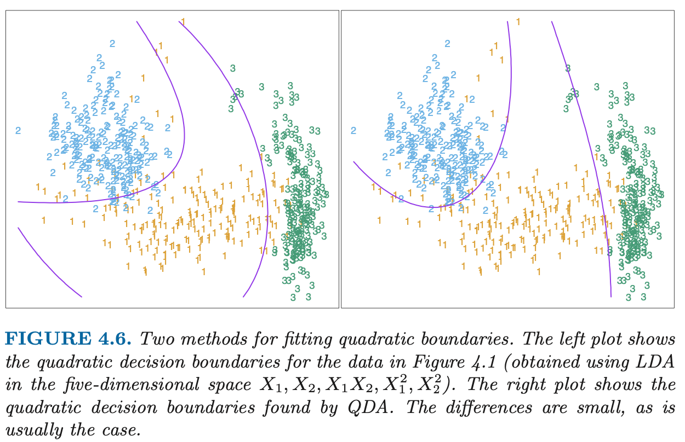

> For this figure and many similar figures in the book we compute the decision bound- aries by an exhaustive contouring method. We compute the decision rule on a fine lattice of points, and then use contouring algorithms to compute the boundaries.

When $p$ is large this can mean a dramatic increase in parameters. For LDA, it seems there are $(K-1)\times(p+1)$ parameters, while for QDA there will be $(K-1)\times\{p(p+1)/2+p+1\}$ parameters. Both LDA and QDA perform well on an amazingly large and diverse set of classification tasks. The question arises why LDA and QDA have such a good track record. The reason is not likely to be that the data are approximately Gaussian, and in addition for LDA that the covariances are approximately equal. **More likely a reason is that the data can only support simple decision boundaries such as linear or quadratic, and the estimates provided via the Gaussian models are stable.** This is a bias variance tradeoff—we can put up with the bias of a linear decision boundary because it can be estimated with much lower variance than more exotic alternatives. This argument is less believable for QDA, since it can have many parameters itself, although perhaps fewer than the non-parametric alternatives.

### **4.3.1 Regularized Discriminant Analysis**

Friedman (1989) proposed a compromise between LDA and QDA, which allows one to shrink the separate covariances of QDA toward a common covariance as in LDA. These methods are very similar in flavor to ridge regression. The regularized covariance matrices have the form
$$\tag{4.13}
\hat{\Sigma}_k(\alpha) = \alpha\hat{\Sigma}_k+(1-\alpha)\hat{\Sigma},
$$
where $\alpha\in [0,1]$ and $\hat{\Sigma}$ is the pooled covariance matrix as used in LDA. In practice $\alpha$ can be chosen based on the performance of the model on validation data, or by cross-validation.

Figure 4.7 shows the results of RDA applied to the vowel data.

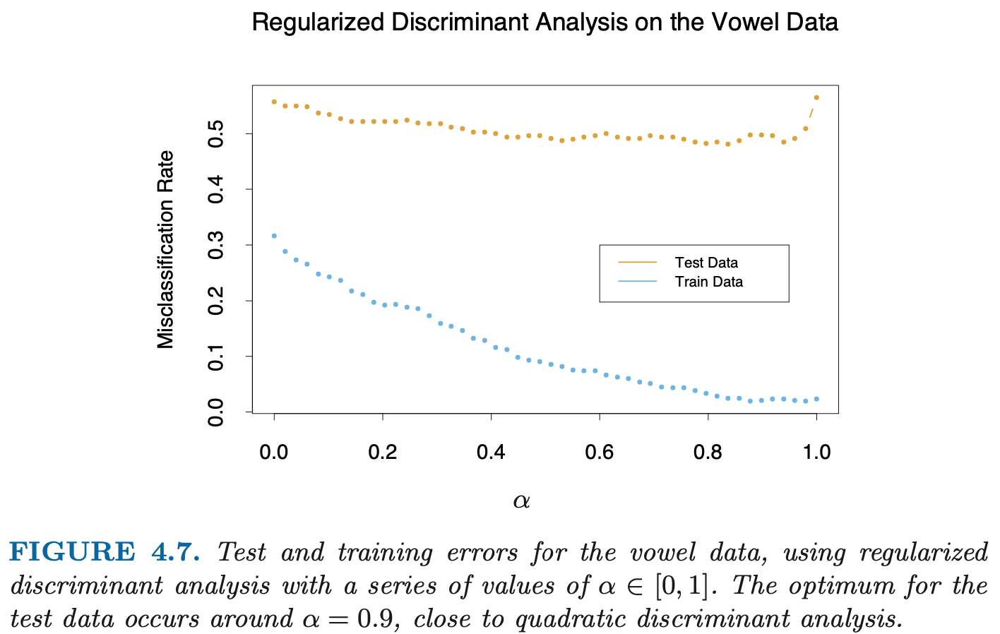

Similar modifications allow $\hat{\Sigma}$ itself to be shrunk toward the scalar covariance,

$$\tag{4.14}
\hat{\Sigma}(\gamma) = \gamma\hat{\Sigma}+(1-\gamma)\hat{\sigma}^2\mathbf{I}
$$

for $\gamma\in [0,1]$. Replacing $\hat{\Sigma}$ in (4.13) by $\hat{\Sigma}(\gamma)$ leads to a more general family of covariances $\hat{\Sigma}(\alpha, \gamma)$ indexed by a pair of parameters.

In Chapter 12, we discuss other regularized versions of LDA, which are more suitable when the data arise from digitized analog signals and images. In Chapter 18 we also deal with very high-dimensional problems, where for example the features are gene- expression measurements in microarray studies. There the methods focus on the case $\gamma = 0$ in (4.14), and other severely regularized versions of LDA.

### **4.3.2 Computations for LDA**

We briefly digress on the computations required for LDA and especially QDA. By the eigen decomposition for each $\hat{\Sigma}_k=\mathbf{U_kD_kU_k}^T$, where $\mathbf{U}_k$ is $p\times p$ orthonormal and $\mathbf{D}_k$ a diagonal matrix of positive eigenvalues $d_{k\ell}$. Then the ingredients for $\delta_k(x)$ (4.12) are
  -  $(x-\hat{\mu}_k)^T\hat{\Sigma}_k^{-1}(x-\hat{\mu}_k) = [\mathbf{U}_k^T(x-\hat{\mu}_k)]^T\mathbf{D}_k^{-1}[\mathbf{U}_k^T(x-\hat{\mu}_k)]$;
  - $\log|\hat{\Sigma}_k|=\sum_{\ell}\log d_{k\ell}$.

In light of the computational steps outlined above, the LDA classifier
can be implemented by the following pair of steps:

  - *Sphere* the1data with respect to the common covariance estimate $\hat{\Sigma}: X^* \leftarrow D^{-\frac{1}{2}} U^T X$, where $\hat{\Sigma} = \mathbf{UDU}^T$. The common covariance estimate of $X^*$ will now be the identity.
  
    > Since $\hat{\Sigma} = \mathbf{UDU}^T$, 
    > $$
    \hat{\Sigma}^* = \mathbf{D}^{-\frac{1}{2}}\mathbf{U}^T\hat{\Sigma}\mathbf{U}\mathbf{D}^{-\frac{1}{2}} = \mathbf{D}^{-\frac{1}{2}}\mathbf{U}^T\mathbf{U}\mathbf{D}\mathbf{U}^T\mathbf{U}\mathbf{D}^{-\frac{1}{2}} = \mathbf{I}.

    > $$

  - Classify to the closest class centroid in the transformed space, modulo the effect of the class prior probabilities $\pi_k$.
    >  $$\delta^*_k(x)=-\frac{1}{2}\|x^*-\hat{\mu}^*_k\|_2^2+\log \pi_k$$ 

### **4.3.3 Reduced-Rank Linear Discriminant Analysis**

LDA as a restricted Gaussian classifier allow us to view informative low-dimensional projections of the data. The $K$ centroids in $p$-dimensional input space lie in an affine subspace of dimension $\leq K-1$, and if $p$ is much larger than $K$, this will be a considerable drop in dimension. Moreover, in locating the closest centroid, we can ignore distances orthogonal to this subspace, since they will contribute equally to each class. Thus there is a fundamental dimension reduction in LDA, namely, that we need only consider the data in a subspace of dimension at most $K − 1$.

We might then ask for a $L< K-1$ dimensinal subspace $H_L\subset H_{K-1}$ optimal for LDA in some sense. Fisher defined optimal to mean that the projected centroids were spread out as much as possible in terms of variance. This amounts to finding principal component subspaces of the centroids themselves. 

Figure 4.4 shows such an optimal two-dimensional subspace for the vowel data. Here there are eleven classes, each a different vowel sound, in a ten-dimensional input space. The centroids require the full space in this case, since $K − 1 = p$, but we have shown an optimal two-dimensional subspace.  The dimensions are ordered, so we can compute additional dimensions in sequence.

Figure 4.8 shows four additional pairs of coordinates, also known as canonical or discriminant variables.

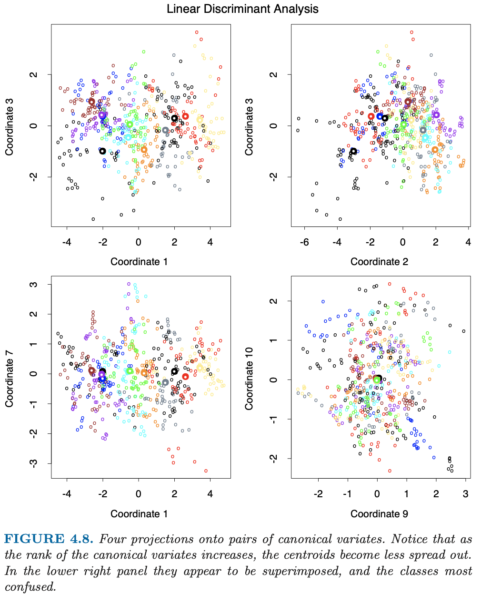

In summary, finding the sequences of optimal subspaces for LDA involves the following steps:
  - compute the $K\times p$ matrix of class centroids $\mathbf{M}$ and the common covariance matrix $\mathbf{W}$ (for within-class covariance);
  - compute $\mathbf{M}^*=\mathbf{M}\mathbf{W}^{-\frac{1}{2}}$ using the eigen-decomposition of $\mathbf{W}$;
  - compute $\mathbf{B}^*$, the covariance matrix of $\mathbf{M}^*$ ($\mathbf{B}$ for between-class covariance), and its eigen-decomposition $\mathbf{B}^*=\mathbf{V}^*\mathbf{D}_{B}\mathbf{V}^{*T}$. The columns $v_{\ell}^*$ of $\mathbf{V}^*$ in sequence from first to last define the coordinates of the optimal subspaces.

Combining all these operations the $\ell$th discriminant variable is given by $Z_{\ell}=v_{\ell}^TX$ with $v_{\ell}=\mathbf{W}^{-\frac{1}{2}}v_{\ell}^*$.

Fisher arrived at this decomposition via a different route, without referring to Gaussian distributions at all. He posed the problem:

*Find the linear combination $Z = a^TX$ such that the between-class variance is maximized relative to the within-class variance.*

> The between class variance matrix is the variance of the class means of $X$, 
> $$
\mathbf{B} = \sum_{k=1}^{K}\sum_{g_{i}=k}{(\hat{\mu}_{k}-\hat{\mu})(\hat{\mu}_{k}-\hat{\mu})^{T}/(K-1)},
> $$
>
>
> the within class variance is the pooled variance about the means
> $$
\mathbf{W} = \sum_{k=1}^{K}\sum_{g_{i}=k}{(x_{i}-\hat{\mu}_{k})(x_{i}-\hat{\mu}_{k})^{T}/(N-K)},
> $$
> The total covariance matrix of $X$, ignoring class information
> $$
\mathbf{T} = \sum_{k=1}^K\sum_{g_i=k}(x_i-\hat{\mu})(x_i-\hat{\mu})^T/(N-1).
> $$
> It is easy to prove that $\mathbf{T=B+W}$.
> The between-class variance of $Z$ is $a^T\mathbf{B}a$ and the within-class variance is $a^T\mathbf{W}a$.

Figure 4.9 shows why this criterion makes sense. 

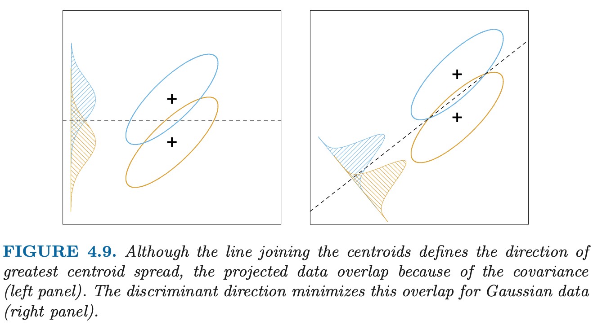

Fisher's problem therefore amounts to maximizing the *Rayleigh quotient*,
$$\tag{4.15}
\max_a\frac{a^T\mathbf{B}a}{a^T\mathbf{W}a},
$$
or equivalently 
$$\tag{4.16}
\max_a a^T\mathbf{B}a \text{ subject to } a^T\mathbf{W}a=1.
$$
> which can rewrite after the convenient basis change $a^* = \mathbf{W}^{1/2}a$, $a^T\mathbf{B}a = a^{*T}\mathbf{W}^{-1/2}\mathbf{B}\mathbf{W}^{-1/2}a^* = a^{*T}\mathbf{B}^*a^*$, 
> $$
\min_{a^*}-\frac{1}{2}a^{*T}\mathbf{B}^*a^* \text{ subject to } a^{*T}a^*=1.
> $$
> The Lagrangien for this problem writes
> $$
L=-\frac{1}{2}a^{*T}\mathbf{B}^*a^*+\frac{1}{2}\lambda(a^{*T}a^*-1).
> $$
> and the Karush-Kuhn-Tucker conditions give
> $$
\mathbf{B}^*a^*=\lambda a^* \equiv \mathbf{W}^{-1}\mathbf{B}a=\lambda a.
> $$
> Thus, the optimal $a^*$ corresponding the largest eigenvalue of $\mathbf{B}^*$, that is  $v_{1}^*$. And $a$ given by the largest eigenvalue of $\mathbf{W}^{-1}\mathbf{B}$. Similarly one can find the next direction $v_{2}^*$, and so on. $v_{\ell}=\mathbf{W}^{-\frac{1}{2}}v_{\ell}^*$.
>  It is not hard to show (Exercise 4.1) that the optimal $a_1$ is identical to $v_1$ defined above. 

The $a_{\ell}$ are referred to as discriminant coordinates, not to be confused with discriminant functions. They are also referred to as *canonical variates*, since an alternative derivation of these results is through a canonical correlation analysis of the indicator response matrix $\mathbf{Y}$ on the predictor matrix $\mathbf{X}$. This line is pursued in Section 12.5.

To summarize the developments so far:
  - Gaussian classification with common covariances leads to linear deci- sion boundaries. Classification can be achieved by sphering the data with respect to $\mathbf{W}$, and classifying to the closest centroid (modulo $\log\pi_k$) in the sphered space.
  - Since only the relative distances to the centroids count, one can confine the data to the subspace spanned by the centroids in the sphered space.
  - This subspace can be further decomposed into successively optimal subspaces in term of centroid separation. This decomposition is identical to the decomposition due to Fisher.

One can show that this is a Gaussian classification rule with the additional restriction that the centroids of the Gaussians lie in a $L$-dimensional subspace of $\mathbb{R}^p$. Fitting such a model by maximum likelihood, and then constructing the posterior probabilities using Bayes’ theorem amounts to the classification rule described above (Exercise 4.8).
> Exercise 4.8

Gaussian classification dictates the logπk correction factor in the dis- tance calculation. The reason for this correction can be seen in Figure 4.9. The misclassification rate is based on the area of overlap between the two densities. If the $\pi_k$ are equal (implicit in that figure), then the optimal cut-point is midway between the projected means. If the $\pi_k$ are not equal, moving the cut-point toward the smaller class will improve the error rate. As mentioned earlier for two classes, one can derive the linear rule using LDA (or any other method), and then choose the cut-point to minimize misclassification error over the training data.

Figure 4.10 shows the results. Figure 4.11 shows the decision boundaries for the classifier based on the two-dimensional LDA solution.

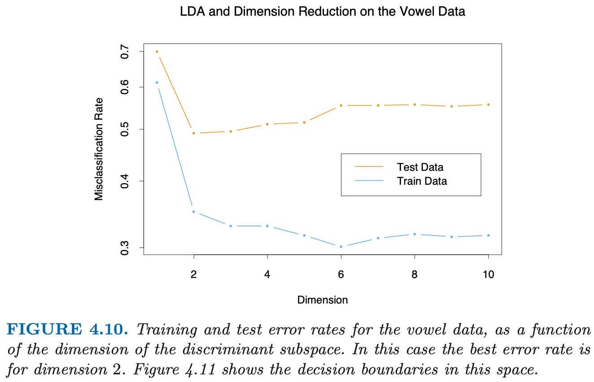

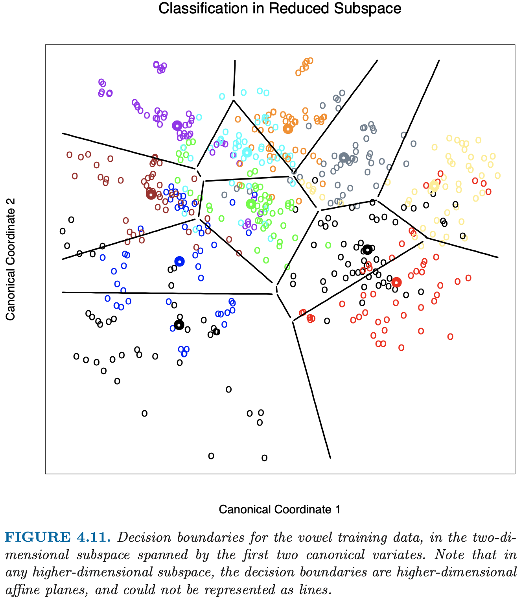

There is a close connection between Fisher’s reduced rank discriminant analysis and regression of an indicator response matrix. It turns out that LDA amounts to the regression followed by an eigen-decomposition of $\hat{\mathbf{Y}}^T\mathbf{Y}$.  In the case of two classes, there is a single discriminant variable that is identical up to a scalar multiplication to either of the columns of $\hat{\mathbf{Y}}$. These connections are developed in Chapter 12. A related fact is that if one transforms the original predictors $\mathbf{X}$ to $\hat{\mathbf{Y}}$ , then LDA using $\hat{\mathbf{Y}}$ is identical to LDA in the original space (Exercise 4.3).
> Exercise 4.3.

## **4.4 Logistic Regression**

The logistic regression model arises from the desire to model the posterior probabilities of the $K$ classes via linear functions in $x$, while at the same time ensuring that they sum to one and remain in $[0,1]$.
 $$\tag{4.18}
  \begin{aligned}
    \Pr(G=k|X=x) &= \frac{\exp(\beta_{k0}+\beta_k^Tx)}{1+\sum_{\ell=1}^{K-1}\exp(\beta_{\ell 0}+\beta_{\ell}^Tx)}, k = 1,..., K-1\\
     \Pr(G=K|X=x) &= \frac{1}{1+\sum_{\ell=1}^{K-1}\exp(\beta_{\ell 0}+\beta_{\ell}^Tx)}.
  \end{aligned}
$$
The entire parameter set $\theta=\{\beta_{10}, \beta_1^T,..., \beta_{(K-1)0}, \beta^T_{K-1}\}$, we denote the probabilities $\Pr(G=k|X=x)=p_k(x;\theta)$.

### **4.4.1 Fitting Logistic Regression Models**

Logistic regression models are usually fit by maximum likelihood, using the conditional likelihood of $G$ given $X$.  Since $\Pr(G|X)$ completely specifies the conditional distribution, the multinomial distribution is appropriate. The log-likelihood for $N$ observations is
$$\tag{4.19}
\ell(\theta) = \sum_{i=1}^N\log p_{g_i}(x_i;\theta).
$$

In the two-class case, via a $0/1$ response $y_i$, the log-likelihood can be written
$$\tag{4.20}
\ell(\beta) = \sum_{i=1}^N\{y_i\log p(x_i;\beta)+(1-y_i)\log(1-p(x_i;\beta))\}
$$
we assume that the vector of inputs $x_i$ includes the constant term 1 to accommodate the intercept.

Let $\mathbf{X}$ be the $N\times (p+1)$ matrix of $x_i$ values, $\mathbf{p}$ the vector of fitted probabilities with $i$th element $p(x_i;\beta^{\text{old}})$ and $\mathbf{W}$ a $N\times N$ diagonal matrix of weights with $i$th diagonal element $p(x_i;\beta^{\text{old}})(1-p(x_i;\beta^{\text{old}}))$. Then we have the score equation
$$\tag{4.24}
\frac{\partial \ell(\beta)}{\beta} = \mathbf{X}^T(\mathbf{y}-\mathbf{p})
$$
$$\tag{4.25}
\frac{\partial^2 \ell(\beta)}{\beta\beta^T} = -\mathbf{X}^T\mathbf{W}\mathbf{X}.
$$
The Newton step is thus
$$\tag{4.26}
\begin{aligned}
\beta^{\text{new}} &= \beta^{\text{old}} + (\mathbf{X}^T\mathbf{W}\mathbf{X})^{-1}\mathbf{X}^T(\mathbf{y}-\mathbf{p})\\
&= (\mathbf{X}^T\mathbf{W}\mathbf{X})^{-1}\mathbf{X}^T\mathbf{W}(\mathbf{X}\beta^{\text{old}}+\mathbf{W}^{-1}(\mathbf{y}-\mathbf{p}))\\
&=(\mathbf{X}^T\mathbf{W}\mathbf{X})^{-1}\mathbf{X}^T\mathbf{W}\mathbf{z}.
\end{aligned}
$$
since at each iteration $\mathbf{p}$ changes, and hence so does $\mathbf{W}$ and $\mathbf{z}$.In the second and third line we have re-expressed the Newton step as a weighted least squares step, with the response
$$\tag{4.27}
\mathbf{z}=\mathbf{X}\beta^{\text{old}}+\mathbf{W}^{-1}(\mathbf{y}-\mathbf{p}).
$$
This algorithm is referred to as *iteratively reweighted least squares* or IRLS, since each iteration solves the weighted least squares problem:
$$\tag{4.28}
\beta^{\text{new}} \leftarrow \argmin_{\beta}(\mathbf{z}-\mathbf{X}\beta)^T\mathbf{W}(\mathbf{z}-\mathbf{X}\beta).
$$
It seems that $\beta = 0$ is a good starting value for the iterative procedure, although convergence is never guaranteed. Typically the algorithm does converge, since the log-likelihood is concave, but overshooting can occur. In the rare cases that the log-likelihood decreases, step size halving will guarantee convergence.

For the multiclass case $(K \geq 3)$ the Newton algorithm can also be expressed as an iteratively reweighted least squares algorithm, but with a vector of $K−1$ responses and a nondiagonal weight matrix per observation. The latter precludes any simplified algorithms, and in this case it is numerically more convenient to work with the expanded vector $θ$ directly (Exercise 4.4). 
> Exercise 4.4.

Alternatively coordinate-descent methods (Section 3.8.6) can be used to maximize the log-likelihood efficiently. 

Logistic regression models are used mostly as a data analysis and inference tool, where the goal is to understand the role of the input variables. in explaining the outcome. Typically many models are fit in a search for a parsimonious model involving a subset of the variables, possibly with some interactions terms. The following example illustrates some of the issues involved.
- Example: South African Heart Disease

### **4.4.3 Quadratic Approximations and Inference**

The maximum-likelihood parameter estimates $\hat{\beta}$ satisfy a self-consistency relationship: they are the coefficients of a weighted least squares fit, where the responses are
$$\tag{4.29}
z_i = x_i^T\hat{\beta}+\frac{(y_i-\hat{p}_i)}{\hat{p}_i(1-\hat{p}_i)},
$$
and the weights are $w_i=\hat{p}_i(1-\hat{p}_i)$, both depending on $\hat{\beta}$ itself. Apart from providing a convenient algorithm, this connection with least squares has more to offer:
  - The weighted residual sum-of-squares is the familiar Pearson chi-square statistic
 $$\tag{4.30}
\sum_{i=1}^N\frac{(y_i-\hat{p}_i)^2}{\hat{p}_i(1-\hat{p}_i)},
 $$
 a quadratic approximation to the deviance.
 - Asymptotic likelihood theory says that if the model is correct, then $\hat{\beta}$ is consistent (i.e., converges to the true $\beta$).
 - A central limit theorem then shows that the distribution of $\hat{\beta}$ converges to $N(\beta,(\mathbf{X}^T\mathbf{W}\mathbf{X})^{-1})$. This and other asymptotics can be derived directly from the weighted least squares fit by mimicking normal theory inference.
   > For the weighted least squares, the estimated parameter values are linear combinations of the observed values
   > $$\hat{\beta} = (\mathbf{X}^T\mathbf{W}\mathbf{X})^{-1}\mathbf{X}^T\mathbf{W}\mathbf{y}.
   > $$
   > Therefore, an expression for the estimated variance-covariance matrix of the parameter estimates can be obtained by error propagation from the errors in the observations. Let the variance-covariance matrix for the observations be denoted by $\mathbf{M}$ and that of the estimated parameters by $\mathbf{M}^{\beta}$. Then
   > $$
   \mathbf{M}^{\beta} = (\mathbf{X}^T\mathbf{W}\mathbf{X})^{-1}\mathbf{X}^T\mathbf{W}\mathbf{M}\mathbf{W}^T\mathbf{X}(\mathbf{X}^T\mathbf{W}\mathbf{X})^{-1}.
   > $$
   > when $\mathbf{W}=\mathbf{M}^{-1}$, this simplifies to 
   > $$ \mathbf{M}^{\beta} = (\mathbf{X}^T\mathbf{W}\mathbf{X})^{-1}.
   > $$
   > When unit weights are used ($\mathbf{W} = \mathbf{I}$, the identity matrix), it is implied that the experimental errors are uncorrelated and all equal: $\mathbf{M} = \sigma^2\mathbf{I}$, where $\sigma^2$ is the a priori variance of an observation. 
 - Model building can be costly for logistic regression models, because each model fitted requires iteration. Popular shortcuts are the *Rao score test* which tests for inclusion of a term, and the *Wald test* which can be used to test for exclusion of a term. Neither of these require iterative fitting, and are based on the maximum-likelihood fit of the current model. It turns out that both of these amount to adding or dropping a term from the weighted least squares fit, using the same weights. Such computations can be done efficiently, without recomputing the entire weighted least squares fit.
 - GLM (generalized linear model) objects can be treated as linear model objects, and all the tools available for linear models can be applied automatically.

### **4.4.4 $L_1$ Regularized Logistic Regression**

For logistic regression, we would maximize a penalized version of $(4.20)$
$$\tag{4.31}
\min \bigg\{\sum_{i=1}^N\{y_i\log p(x_i;\beta)+(1-y_i)\log(1-p(x_i;\beta))+\lambda\sum_{j=1}^p|\beta_j|\bigg\}.
$$
The score equations [see (4.24)] for the variables with non-zero coefficients have the form
$$\tag{4.32}
\mathbf{x}_j^T(\mathbf{y}-\mathbf{p}) = \lambda \cdot\text{sign}(\beta_j),
$$
which generalizes (3.58) in Section 3.4.4; the active variables are tied in their *generalized* correlation with the residuals. Path algorithms such as LAR for lasso are more difficult, because thecoefficient profiles are piecewise smooth rather than linear. Nevertheless, progress can be made using quadratic approximations.

Figure 4.13 shows the L 1 regularization path for the South African heart disease data of Section 4.4.2.

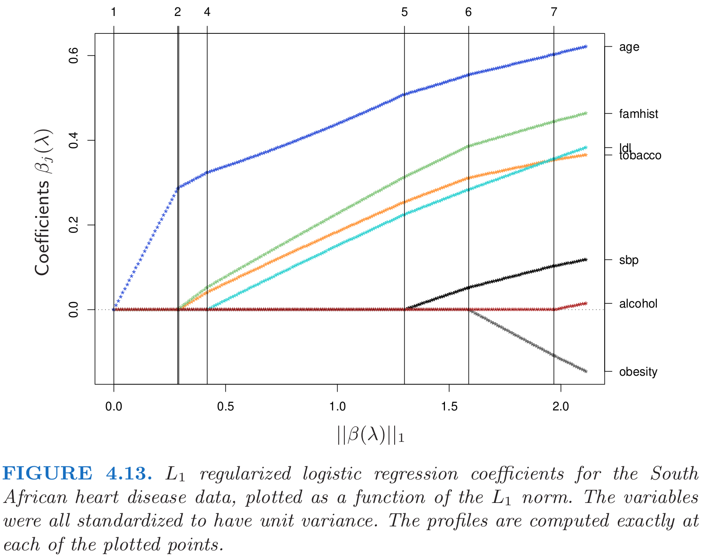

Coordinate descent methods (Section 3.8.6) are very efficient for computing the coefficient profiles on a grid of values for $\lambda$.

### **4.4.5 Logistic Regression or LDA?**

In Sectio 4.3, we find that the log-posterior odds between class $k$ and $K$ are linear function of $x$ (4.9):
$$\tag{4.33}
\begin{aligned}
\log \frac{\Pr(G=k|X=x)}{\Pr(G=K|X=x)}
&=\log\frac{\pi_k}{\pi_{K}}-\frac{1}{2}(\mu_k+\mu_{K})^T\Sigma^{-1}(\mu_k-\mu_{K})+x^T\Sigma^{-1}(\mu_k-\mu_{K})\\
&= \alpha_{k0}+\alpha_{k}^Tx.
\end{aligned}
$$
This linearity is a consequence of the Gaussian assumption for the class densities, as well as the assumption of a common covariance matrix. The linear logistic model (4.17) by construction has linear logits:
$$\tag{4.34}
\log\frac{\Pr(G=k|X=x)}{\Pr(G=K|X=x)} = \beta_{k0}+\beta^kx.
$$

It seems that the models are the same. Although they have exactly the same form, the difference lies in the way the linear coefficients are estimated. The logistic regression model is more general, in that it makes less assumptions.
We can write the *joint density* of $X$ and $G$ as
$$\tag{4.35}
\Pr(X,G=k) = \Pr(X)\Pr(G=k|X),
$$
where $\Pr(X)$ denotes the marginal density of the inputs $X$. For both LDA and logistic regression,  the second term on the right has the logit-linear form
$$\tag{4.36}
\Pr(G=k|X=x) = \frac{e^{\beta_{k0}+\beta_k^Tx}}{1+\sum_{\ell=1}^{K-1}e^{\beta_{\ell0}+\beta_{\ell}^Tx}},
$$
where we have again arbitrarily chosen the last class as the reference. The logistic regression model leaves the marginal density of X as an arbitrary density function $\Pr(X)$, and fits the parameters of $\Pr(G|X)$ by maximizing the conditional likelihood—the multinomial likelihood with probabilities the $\Pr(G = k|X)$. Although $\Pr(X)$ is totally ignored, we can thinkof this marginal density as being estimated in a fully nonparametric and unrestricted fashion, using the empirical distribution function which places mass $1/N$ at each observation.

With LDA we fit the parameters by maximizing the full log-likelihood based on the joint density 
$$\tag{4.37}
\Pr(X,G=k) = \phi(X;\mu_k,\Sigma)\pi_k,
$$
where $\phi$ is the Gaussian density function. Since the linear parameters of the logistic form (4.33) are functions of the Gaussian parameters, we get their maximum-likelihood estimates by plugging in the corresponding estimates. However, unlike in the conditional case, the marginal density Pr(X) does play a role here. It is a mixture density
$$\tag{4.38}
\Pr(X) = \sum_{k=1}^K \pi_k\phi(X;\mu_k,\Sigma),
$$
which also involvs the parameters.

**The additional model assumption:** By relying on the additional model assumptions, we have more information about the parameters, and hence can estimate them more efficiently (lower variance). If in fact the true $f_k(x)$ are Gaussian, then in the worst case ignoring this marginal part of the likelihood constitutes a loss of efficiency of about 30\% asymptotically in the error rate (Efron, 1975). Paraphrasing: with 30\% more data, the conditional likelihood will do as well.

For example, observations far from the decision boundary (which are **down-weighted** by logistic regression) play a role in estimating the common covariance matrix. This is not all good news, **because it also means that LDA is not robust to gross outliers.**

From the mixture formalution, unlabeled observation have information about parameters.

**The marginal likelihood can be thought of as a regularizer**, requiring in some sense that class densities be visible from this marginal view. For example, if the data in a two-class logistic regression model can be perfectly separated by a hyperplane, the maximum likelihood estimates of the parameters are undefined (i.e., infinite; see Exercise 4.5). The LDA coefficients for the same data will be well defined, since the marginal likelihood will not permit these degeneracies.
> Exercise 4.5.

In practice these assumptions are never correct, and often some of the components of $X$ are qualitative variables. It is generally felt that logistic regression is a safer, more robust bet than the LDA model, relying on fewer assumptions. It is our experience that the models give very similar results, even when LDA is used inappropriately, such as with qualitative predictors.

## **4.5 Separating Hyperplanes**

Separating hyperplane classifiers procedures construct linear decision boundaries that explicitly try to separate the data into different classes as well as possible. They provide the basis for support vector classifiers, discussed in Chapter 12.

Figure 4.14 shows 20 data points in two classes in $\mathbb{R}^2$. 

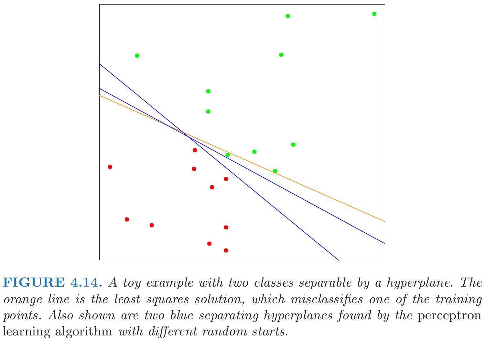

The orange line is the least squares solution to the problem, obtained by regressing the $-1/1$ response $Y$ and $X$ (with intercept); the line is given by
$$\tag{4.39}
\{x:\hat{\beta}_0+\hat{\beta}_1x_1+\hat{\beta}_2x_2=0\}.
$$

This least squares solution does not do a perfect job in separating the points, and makes one error. This is the same boundary found by LDA, in light of its equivalence with linear regression in the two-class case (Section 4.3 and Exercise 4.2).

Classifiers such as (4.39), that compute a linear combination of the input features and return the sign, were called *perceptrons* in the engineering literature in the late 1950s.

Before we continue, let us digress slightly and review some vector algebra. Figure 4.15 depicts a hyperplane or *affine set* $L$ defined by the equation $f(x)=\beta_0+\beta^Tx=0$; since we are in $\mathbb{R}^2$ this is a line.

Here we list some properties:

1. For any two points $x_1$ and $x_2$ lying in $L$, $\beta^T(x_1-x_2)=0$, and hence $\beta^*=\beta/\|\beta\|$ is the vector normal to the surface of $L$.
2. For any point $x_0$ in $L$, $\beta^Tx_0=-\beta_0$.
3. The signed distance of any point $x$ to $L$ is given by
$$\tag{4.40}
\beta^{*T}(x-x_0) = \frac{1}{\|\beta\|}(\beta^Tx+\beta_0) = \frac{1}{\|f'(x)\|}f(x).
$$
Hence $f(x)$ is proportional to the signed distance from $x$ to the hyperplane defined by $f(x)=0$.

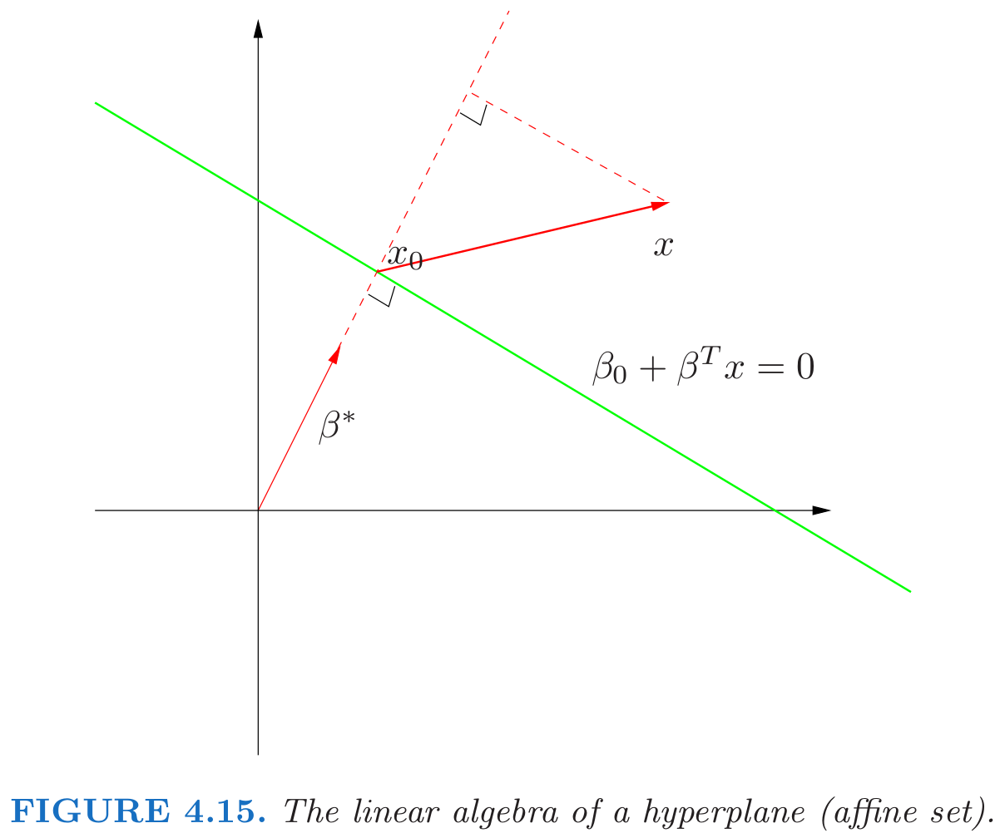

## **4.5.1 Rosenblatt’s Perceptron Learning Algorithm**

The perceptron learning algorithm tries to find a separating hyperplane by minimizing the distance of misclassified points to the decision boundary. If a response $y_i=1$ is misclassified, then $x_i^T\beta+\beta_0 < 0$, and the opposite for a misclassified response with $y_i=-1$. The goal is to minimize
$$\tag{4.41}
D(\beta,\beta_0) = -\sum_{i\in \mathcal{M}} y_i(x_i^T\beta+\beta_0),
$$
where $\mathcal{M}$ indexes the set of misclassified points. The quantity is non-negative and proportional to the distance of the misclassified points to the decision boundary defined by $\beta^Tx+\beta_0=0$. The gradient (assuming $\mathcal{M}$ is fixed) is given by
$$\tag{4.42}
\frac{\partial D(\beta, \beta_0)}{\partial \beta} = -\sum_{i\in \mathcal{M}}y_ix_i,
$$
$$\tag{4.43}
\frac{\partial D(\beta, \beta_0)}{\partial \beta_0} = -\sum_{i\in \mathcal{M}}y_i.
$$
The algorithm in fact uses *stochastic gradient descent* to minimize this piecewise linear criterion. Hence the misclassified observations are visited in some sequence, and the parameters $\beta$ are updated via
$$\tag{4.44}
\begin{pmatrix}
\beta \\
\beta_0
\end{pmatrix} \leftarrow \begin{pmatrix}
\beta \\
\beta_0
\end{pmatrix} + \rho \begin{pmatrix}
y_ix_i \\
y_i
\end{pmatrix}.
$$
Here $\rho$ is the learning rate, which in this case can be taken to be 1 without loss in generality. If the classes are linearly separable, it can be shown that the algorithm converges to a separating hyperplane in a finite number of steps (Exercise 4.6).
> Exercise 4.6

Figure 4.14 shows two solutions to a toy problem, each started at a different random guess.

There are a number of problems with this algorithm, summarized in Ripley (1996):
- When the data are separable, there are many solutions, and which one is found depends on the starting values.
- The “finite” number of steps can be very large. The smaller the gap, the longer the time to find it.
- When the data are not separable, the algorithm will not converge, and cycles develop. The cycles can be long and therefore hard to detect.

The second problem can often be eliminated by seeking a hyperplane not in the original space, but in a much enlarged space obtained by creating many basis-function transformations of the original variables. This is analogous to driving the residuals in a polynomial regression problem down to zero by making the degree sufficiently large. Perfect separation cannot always be achieved: for example, if observations from two different classes share the same input. It may not be desirable either, since the resulting model is likely to be overfit and will not generalize well. We return to this point at the end of the next section.

A rather elegant solution to the first problem is to add additional constraints to the separating hyperplane.

### **4.5.2 Optimal Separating Hyperplanes 🤔**

The *optimal separating hyperplane* separates the two classes by maximizing the margin between the two classes on the training data. We need to generalize criterion (4.41). Considering the optimization problem
$$\tag{4.45}
\max_{\beta,\beta_0, \|\beta\|=1} M\\
\text{subject to } y_i(x_i^T\beta+\beta_0) \geq M, i=1,...,N.
$$
We can get rid of the $\|\beta\|=1$ constraint by replacing the condition with
$$\tag{4.46}
\frac{1}{\|\beta\|}y_i(x_i^T\beta+\beta_0) \geq M, 
$$
or equivalently
$$\tag{4.47}
y_i(x_i^T\beta+\beta_0) \geq M\|\beta\|.
$$
Since for any $\beta$ and $\beta_0$ satisfying these inequalities, any positively scaled multiple satisfies them too, we can arbitrarily set $\|\beta\|=1/M$. Thus (4.45) is equivalent to 
$$\tag{4.48}
\min_{\beta,\beta_0} \frac{1}{2}\|\beta\|^2\\
\text{subject to }y_i(x_i^T\beta+\beta_0)\geq 1, i=1,...,N.
$$
In light of (4.40), the constraints define an empty slab or margin around the linear decision boundary of thickness $1/\|\beta\|$. Hence we choose $\beta$ and $\beta_0$ to maximize its thickness. This is a convex optimization problem, and the Lagrange function, to be minimized w.r.t $\beta$ and $\beta_0$, is 
$$\tag{4.49}
L_P=\frac{1}{2}\|\beta\|^2-\sum_{i=1}^N\alpha_i[y_i(x_i^T\beta+\beta_0)-1].
$$
Setting the derivatives to zero, we obtain:
$$\tag{4.50}
\begin{aligned}
\beta &= \sum_{i=1}^N\alpha_iy_ix_i,\\
0 &= \sum_{i=1}^N \alpha_iy_i
\end{aligned}
$$
and substituting these in (4.49) we obtain the so-called Wolfe dual
$$\tag{4.51}
L_D = \sum_{i=1}^N \alpha_i-\frac{1}{2}\sum_{i=1}^N\sum_{k=1}^N \alpha_i\alpha_ky_iy_kx_i^Tx_k\\
\text{subject to } \alpha_i\geq 0 \text{ and } \sum_{i=1}^N\alpha_iy_i = 0. 
$$
The solution is obtained by maximizing L D in the positive orthant, a simpler convex optimization problem, for which standard software can be used. In addition the solution must satisfy the Karush–Kuhn–Tucker conditions, which include (4.50), (4.51), (4.52) and
$$ \alpha_i[y_i(x^T_i\beta + \beta_0 ) − 1] = 0 \quad \forall i.$$

From these we can see that
- if $\alpha_i > 0$, then $y_i(x^T_i\beta + \beta_0 )=1$, or in other words, $x_i$ is on the boundary of the slab;
- if $y_i(x^T_i\beta + \beta_0)>1$, $x_i$ is not on the boundary of the slab, and $a_i=0$.

From (4.50) we see that the solution vector $\beta$ is defined in terms of a linear combination of the support points $x_i$ —— those points defined to be on the boundary of the slab via $\alpha_i > 0$. Figure 4.16 shows the optimal separating hyperplane for our toy example; there are three support points. Likewise, $\beta$ is obtained by solving (4.53) for any of the support points.

The optimal separating hyperplane produces a function $\hat{f}(x) = x^T \hat{\beta}+ \hat{\beta}_0$ for classifying new observations:
$$\tag{4.54}
\hat{G}(x) = \text{sign}\hat{f}(x).
$$

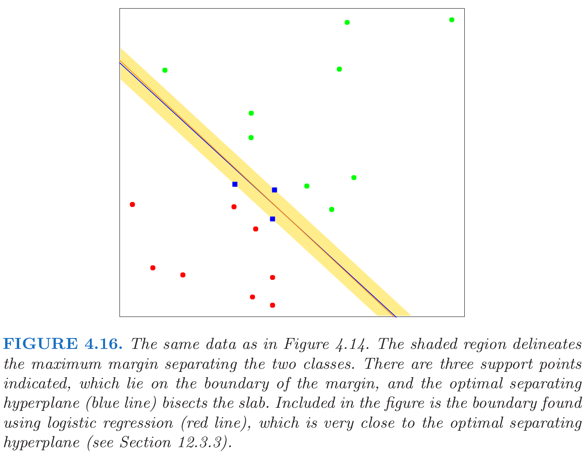

Although none of the training observations fall in the margin (by construction), this will not necessarily be the case for test observations. The intuition is that a large margin on the training data will lead to good separation on the test data.

**Relation to LDA:** The description of the solution in terms of support points seems to suggest that the optimal hyperplane focuses more on the points that count, and is more robust to model misspecification. The LDA solution, on the other hand, depends on all of the data, even points far away from the decision boundary. Note, however, that the identification of these support points required the use of all the data. Of course, if the classes are really Gaussian, then LDA is optimal, and separating hyperplanes will pay a price for focusing on the (noisier) data at the boundaries of the classes.

**Relation to logistic regression** When a separating hyperplane exists, logistic regression will always find it, since the log-likelihood can be driven to 0 in this case (Exercise 4.5). The logistic regression solution shares some other qualitative features with the separating hyperplane solution. The coefficient vector is defined by a weighted least squares fit of a zero-mean linearized response on the input features, and the weights are larger for points near the decision boundary than for those further away.
> Exercise 4.5.

When the data are not separable, there will be no feasible solution to this problem, and an alternative formulation is needed. Again one can enlarge the space using basis transformations, but this can lead to artificial separation through over-fitting. In Chapter 12 we discuss a more attractive alternative known as the support vector machine, which allows for overlap, but minimizes a measure of the extent of this overlap.