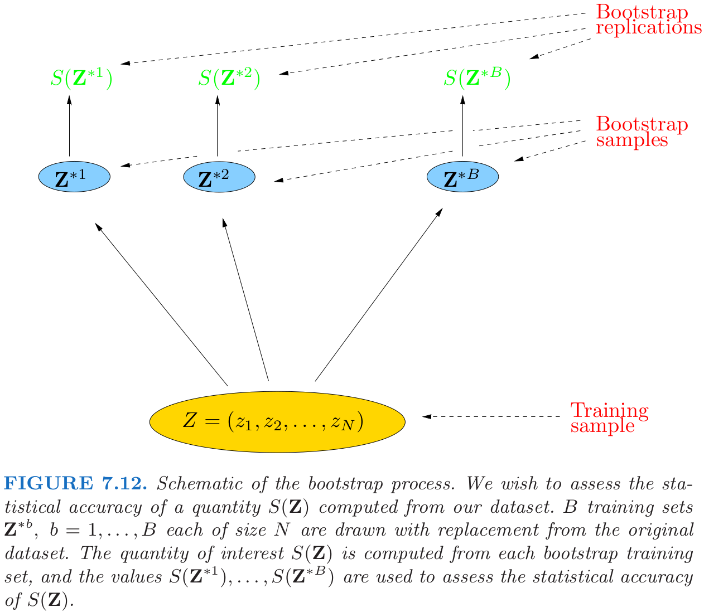

<!-- 
 -->

# **Model Assessment and Selection**

## 7.11 Bootstrap Methods

The boostrap is a general tool for assessing statistical accuracy. 
- Describing the bootstrap in general
- How it can be used to estimate extra-sample prediction error
  > Recall the extra-sample is 
  > $$
   \text{Err}_{\Tau} = \text{E}_{X^0,  Y^0}[L(Y^0,\hat{f}(X^0))|\Tau],
   > $$
   > where the training set $\Tau$ is fixed, and $(X^0,Y^0)$ is a new test data point drawn from the joint distribution of the data.
- As with cross-validation, the boot-strap seeks to estimate the conditional error $\text{Err}_{\Tau}$ , but typically estimates
well only the expected prediction error $\text{Err}$.

## Describing the bootstrap in general
Suppose we have a model fit to a set of training data. We denote the training set by $\mathbf{Z} = (z_1 , z_2 , . . . , z_N )$ where $z_i = (x_i , y_i )$. The basic idea is to randomly draw datasets with replacement from the training data, each sample the same size as the original training set. This is done $B$ times ($B = 100$ say), producing $B$ bootstrap datasets, as shown in Figure 7.12. Then we refit the model to each of the bootstrap datasets, and examine the behavior of the fits over the $B$ replications.

In the figure, $S(\mathbf{Z})$ is any quantity computed from the data $\mathbf{Z}$, for example, the prediction at some input point. From the bootstrap sampling we can estimate any aspect of the distribution of $S(\mathbf{Z})$, for example, its variance, which can be thought of as a Monte-Carlo estimate of the variance of $S(\mathbf{Z})$
$$\tag{7.53}
\hat{\text{Var}}[S(\mathbf{Z})] = \frac{1}{B-1} \sum_{b=1}^B(S(\mathbf{Z}^{*b})-\bar{S}^*)^2,
$$
where $\bar{S}^*=\sum_bS(\mathbf{Z}^{*b})/B$.

## How can we apply the bootstrap to estimate prediction error?

  **Method I:** 

  let $\hat{f}^{*b}(x_i)$ is the predicted value at $x_i$ from the model fitted to the $b$th boostrap dataset,
  $$\tag{7.54}
    \widehat{\text{Err}}_{\text{boot}} = \frac{1}{B}\frac{1}{N} \sum_{b=1}^B\sum_{i=1}^N L(y_i, \hat{f}^{*b}(x_i)).
  $$

  $\text{Err}_{\text{boot}}$ can not provide a good estimate since obeservations are in common. Besides, the overlab can make overfit predicitons look unrealistically good.

  **Method II (leave-one-out bootstrap):**
  
  Only keep track of predictions from bootstrap samples not containing that observation. 
$$\tag{7.56}
\widehat{\text{Err}}^{(1)} = \frac{1}{N}\sum_{i=1}^N\frac{1}{|C^{-i}|} \sum_{b\in C^{-i}} L(y_i, \hat{f}^{*b}(x_i)).
$$
  where $C^{-i}$ is the set of indics of the bootstrap samples $b$ that do not contain observation $i$, and $|C^{-i}|$ is the number of such samples. The average number of distinct observations in each bootstrap sample is about $0.632\cdot N$, so its bias will roughly behave like that of twofold cross-validation.
  
**Method III (.632 estimator):**
$$
\widehat{\text{Err}}^{\text{(.632)}} = .368\cdot \overline{\text{err}} + .632\cdot \widehat{
    \text{Err}}^{(1)}.
$$

Intuitively, it pulls the leave-one out bootstrap estimate down toward the training error rate, and hence reduces its upward bias. The .632 estimator works well in “light fitting” situations, but can break down in overfit ones.

**Method IV (.632+ estimator):** 

one can improve the .632 estimator by taking into account the amount of overfitting.  Define $\gamma$ to be the no-information error rate: this is the error rate of our prediction rule if the inputs and class labels were independent. An estimate of $\gamma$ is 
$$\tag{7.58}
\hat{\gamma} = \frac{1}{N^2}\sum_{i=1}^N\sum_{i'=1}^N L(y_i,\hat{f}(x_{i'})).
$$
Using this, the relative overfitting rate is defined to be 
$$\tag{7.60}
\hat{R} = \frac{\widehat{\text{Err}}^{(1)}-\overline{\text{err}}}{\hat{\gamma}-\overline{\text{err}}},
$$
a quantity that ranges from $0$ if there is no overfitting to $1$ if the overfitting equals the no-information value $\hat{\gamma}-\overline{\text{err}}$. Finally, we define the ".632+" estimator by

$$\tag{7.61}
\widehat{\text{Err}}^{(.632+)} = (1-\hat{w})\cdot \overline{\text{err}}+\hat{w}\cdot \widehat{\text{Err}}^{(1)} \text{ with } \hat{w} = \frac{.632}{1-.368\hat{R}}.
$$
The weight $w$ ranges from .632 to 1, so $\widehat{\text{Err}}^{(.632+)}$ ranges from $\widehat{\text{Err}}^{(.632)}$ to $\widehat{\text{Err}}^{(1)}$.

## 7.11.1 Example.